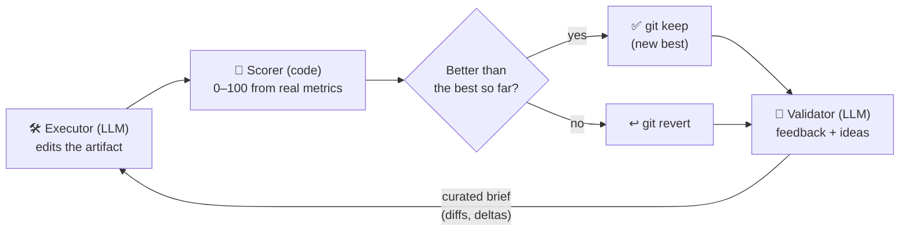
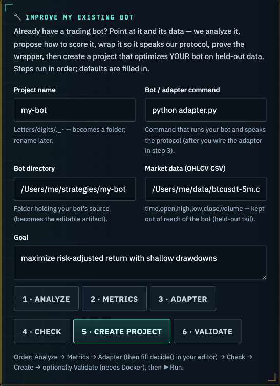

**English** · [Українська](README.uk.md) · [Русский](README.ru.md)

# Pull-and-Push

**Two AIs push each other to make your work better — automatically.**

One AI rewrites the thing you want improved. A small piece of code grades the result from
0 to 100 — honestly, from real numbers, not opinions. A second AI reads the result and
points out what's weak and what to try next. Then the loop runs again. Every round it keeps
the best version so far and throws the rest away. After a few hundred rounds you get
something far better than the first try — and you can watch every step happen live.

**Where it helps** — anything you can put a number on:

- a trading strategy that should earn more without getting wiped out,
- code that has to make a hidden test suite pass,
- a piece of writing you want to score higher against a rubric.

You bring the goal and a way to measure it. Pull-and-Push runs the thousands of small
attempts for you and hands back the best one.


> A real run. The score starts low; the loop keeps improving and climbs toward the target,
> keeping the best version at every step. The dip near step #33 is the loop breaking out of
> a dead end and finding a better idea.

## How it works



The thing being improved lives in git, so any change can be undone instantly. The grader
lives *outside* it, so the AI can't peek at the answer key or mark its own homework. The
loop is plain: **edit → grade → keep if better → get feedback → repeat**, until the score
hits your target or stops improving. The best version is what you take away.

## Screenshots

| Live control & progress | Activity feed (newest-first) |
|---|---|
|  |  |
| Composite score, per-metric cards (with their goals), and the quality curve. | A collapsible right rail: every iteration is a card (verdict-coloured), the validator's review and the executor's output render as Markdown. |

| Start a project in one step | Whole workspace |
|---|---|
|  |  |
| Pick a vetted template (ships a working scorer) **or** generate a project from a plain-language description. | Sidebar of projects, the live dashboard, and the activity rail — all in one screen. |

| Improve an existing bot | |
|---|---|
|  | Onboard a bot you already have: analyze → propose metrics → scaffold + check an adapter → create the project, in six guided steps. The loop then optimises **your** bot on held-out data. |

## Under the hood (for builders)

The technical name is an **adversarial co-evolution orchestrator** — in the spirit of GANs,
Karpathy's `autoresearch`, and the `consilium` adapter pattern.

- **Off-the-shelf agents, no custom models.** Each role is an existing CLI agent
  (`claude` / `codex` / `opencode` / `agy`). We only write the parts we fully control: the
  loop, the grader, the metric runner, the state store, and the web UI.
- **The number comes from code; the AI only advises.** A deterministic scorer computes the
  0–100 from objective metrics. The reviewer AI gives words and ideas — never the number.
- **Keep-if-better, tracked in git** — plus a short brief each round carrying the real diffs
  of past attempts, so the next try builds on the last instead of starting blind.
- **Fresh-look checkpoints.** Every 5th iteration both agents get a nudge to step back and
  re-examine the problem from the other side — questioning the core assumption instead of
  grinding one path into a local optimum.
- **You never invent a zero-point.** Give each metric a direction and a target; the scale's
  0 is pinned to your first measurement (0 = where you started, 100 = the goal).
- **Walk-forward scoring (no overfitting).** Where it matters — like the trading template —
  the grader measures on data the AI never tuned on, and shows the in-sample↔out-of-sample
  gap. That's the line between a result that holds up and one that only looked good on paper.

- **Design spec:** `docs/superpowers/specs/2026-06-03-tyani-tolkai-design.md`
- **Plan:** `docs/superpowers/plans/2026-06-03-tyani-tolkai-core-mvp.md`

## Install & run

You need **Python 3.10+** (CPython, not PyPy) and **Git**. To run a real optimization you
also need one AI agent CLI (see the bottom of this section).

```bash
git clone https://github.com/Lexus2016/Pull-and-Push.git
cd Pull-and-Push
./start.sh
```

On **Windows**, use the PowerShell launcher instead of the last line:

```powershell
powershell -ExecutionPolicy Bypass -File .\start.ps1
```

`start.sh` (macOS/Linux) and `start.ps1` (Windows) create the virtualenv, install everything,
and open the dashboard at **http://127.0.0.1:8765**. It is re-runnable — pass `--port 8080` to use another port, or
`--update` to reinstall after a `git pull`. Then, in the browser: **🚀 New project from an
example** → pick a card → name it → describe the goal → **Create** → press **▶ Run**.

To run a *real* optimization you need one AI coding CLI (no API keys are stored here):
install and log in to **claude** (Anthropic), **codex** (OpenAI), or **opencode**, then pick
it in the project. Tip: use *different* providers for the executor and the validator.

<details><summary><b>Prefer to install by hand (or on Windows)?</b></summary>

```bash
python3.12 -m venv .venv           # any CPython 3.10+ works (not PyPy)
source .venv/bin/activate          # Windows: .venv\Scripts\activate
pip install -e ".[web]"
pull-and-push web                  # then open the printed URL (default http://127.0.0.1:8765)
```

Run the tests: `pip install -e ".[dev]"` then `pytest` (151 pass, 1 docker test skipped).

</details>

## Updating (your projects are safe)

Your projects — config, run history, scores and the artifact — live in **`~/.tyani-tolkai/`**
(override with `TYANI_TOLKAI_HOME`), **outside** this repo. So updating the code never touches them.

```bash
cd Pull-and-Push
git pull
./start.sh --update     # reinstall deps + relaunch · Windows: powershell -ExecutionPolicy Bypass -File .\start.ps1 --update
```

- **No data loss.** Old project databases are migrated **in place** on first open (new columns added
  idempotently), so projects you ran on an older version keep working — open one and continue.
- **Scores stay honest across the upgrade.** If you changed a project's metrics/targets, the next
  **▶ Run** automatically re-scores its whole history onto the new metric scale (one consistent
  0–100 scale; the log notes `♻ objective changed → re-scored …`).
- **Optional backup** before a big jump: `cp -r ~/.tyani-tolkai ~/.tyani-tolkai.bak` (Windows: copy
  the `%USERPROFILE%\.tyani-tolkai` folder).

## Configuration & troubleshooting

**Cost cap** — set `limits.usd_per_mtok` (price) and `limits.budget_usd` (cap) in the config (or the
form's Budget/Price fields) to hard-stop a run at an estimated spend. The estimate is rough (CLI
agents don't report exact tokens) — a safety cap, not an invoice; the live status shows `≈ $X.XX`.

**Human checkpoints** — enable `checkpoints.on_target` / `on_plateau` / `every_n` to PAUSE for your
review (status *awaiting_review*) instead of finishing; the dashboard shows **Continue** / **Accept
& finish**. (For a *target* checkpoint, raise the target score first if you want to push further.)

**Stable scoring** — set `evaluation.runs: 3` to take the median of N measurements (flaky scorers),
and `evaluation.revalidate_every: N` to periodically re-check the best and demote a noise/fluke win.

**Untrusted generated code** — `sandbox.backend: local` runs the scorer on your host (fast, for code
you trust). For code you don't fully trust, use `sandbox.backend: docker` to isolate execution.

**Environment (optional)** — nothing secret is needed to start:

| Variable | Purpose |
|----------|---------|
| `TYANI_TOLKAI_WEB_PASSWORD` | If set, the dashboard requires `?token=<value>`. Leave empty for localhost. |
| `TYANI_TOLKAI_HOME` | Where projects live (default `~/.tyani-tolkai`). |

**Agents authenticate themselves** — Pull-and-Push shells out to whichever CLI a project names; no
API keys live here. Install and log in the engines you use: `claude` (Anthropic), `codex` (OpenAI),
`opencode`, `agy` (Google/Antigravity). Tip: use **different** providers for executor vs validator
on non-trivial runs — same model = correlated review blind spots.

**Portable scorer commands** — template commands use a `{python}` placeholder (e.g.
`{python} ../metrics/run_backtest.py`) that the runner replaces with the sandbox interpreter, so
projects run on hosts that only have `python3` (not a bare `python`).

**Common issues**

| Symptom | Fix |
|---------|-----|
| `claude: not found` / agent missing | Install + log in that CLI, or change the engine in the project's config. |
| Rate-limited / quota hit | The run pauses (status `paused`); press **▶ Run** again to resume from the last best. |
| Agent repeats `no_op` (no change) | Brief too vague or the file isn't the editable one — tighten the executor goal/task. |
| A step never ends | Lower `limits.step_seconds` (per-agent timeout), or use **⛔ Force Stop**. |
| `FileNotFoundError: 'python'` | The scorer command hardcodes `python` — use `{python}` (auto-substituted). |
| Dashboard empty after a restart | Select the project — its history loads from `state.db`. |
| Noisy/flaky scorer | Set `evaluation.runs: 3` — the runner takes the median of N measurements. |
| Score dropped after I changed the metrics | Expected — the loop **re-baselined**: it re-measured the current best under the *new* objective so comparisons stay fair (a genuine improvement on the new scale won't be discarded against the old bar). The artifact didn't get worse; the scale did. Logged in the agent log. |

## Quick start — the dashboard

```bash
.venv/bin/pull-and-push web            # open the printed URL (tyani-tolkai also works)
```

- 🚀 **Start from a template** *(recommended)* — the research + scaffold phase. Pick a vetted
  template (or let it auto-detect from your description), name the project, and it is created
  **ready to run**: a real, committed scoring harness lands in `metrics/` (outside the artifact,
  so the executor can't see or edit it), your description becomes the executor's goal. No
  hand-authored scorer, nothing to fix before the first **Run**. Templates today:
  `btcusdt-futures` (leveraged BTCUSDT 5m backtest) and `pytest-pass` (make a hidden test suite pass).
- 🪄 **Generate from a description** — describe the task in plain language; a configurator
  agent drafts the whole project, you review it in the form, then **Create**.
- 🔧 **Improve my existing bot** — onboard a bot you already have (analyze → metrics → adapter →
  check → create), so the loop optimises *your* bot on held-out data. Full walkthrough:
  [Improve an existing bot](#improve-an-existing-bot-onboarding).
- ▶ **Run** drives the real agents. The quality curve and metric cards update live, alongside a
  collapsible **activity feed** (right rail, newest iteration on top): the validator's review and
  the executor's output render as **Markdown**. Your layout — feed open/closed, sidebar, current
  project and tab — is remembered across reloads.
- 📈 **Switchable chart** — by default it draws the composite **quality curve**. Click any **metric
  card** to chart that metric's real value across the whole run (the axis auto-scales to its units);
  click the **composite score** to switch back. Points stay coloured by verdict, and the chart keeps
  updating live during a run.
- ⛔ **Force Stop** kills the agent instantly; **Stop** waits for the iteration boundary.
- ⬇ **Export** downloads the current best **result as a `.zip`** (artifact code + `README.md` + `RESULTS.md`).
- **UI languages:** English (default) · Ukrainian · Russian — switch in the header (with styled,
  in-design tooltips on every control). The choice and your place in the UI persist across reloads.
- Optional **completion webhook**: call your URL (GET/POST) when a run finishes.

### Snapshots — download, rewind to, or fork any iteration

The highest composite score isn't always the version you want; an intermediate iteration can be
more interesting (say, higher `return_oos_pct` at a slightly lower weighted score). Every **kept**
iteration in the activity feed is a real git commit, so each keep card carries three actions:

- **⬇ Download this version** — a runnable zip of the artifact *at that iteration* (with the
  harness, config and a `SNAPSHOT.txt` noting that iteration's own score) — not just the latest.
- **↻ Continue from here** — rewind the project to that iteration: it becomes the current best, and
  the next **Run** continues from it (with whatever you refine). The dropped tail is tagged in git,
  so nothing is truly lost.
- **⑂ Fork to a new project** — branch that iteration into a separate project; the original stays
  untouched, so you can optimise both directions independently.

Snapshots are offered for **kept** iterations (each is a committed checkpoint); discarded
candidates are reverted and not stored. Rewind/fork are disabled while a run is in progress.

## Improve an existing bot (onboarding)

Already have a trading bot? Optimise **it** — not a template. The dashboard's **🔧 Improve my
existing bot** card (and the matching CLI) walk a safe, gated flow that wraps your bot, proves the
wrapper, then builds a project that tunes your bot on held-out data.


**In the dashboard** — press **＋ New project** and use the *Improve my existing bot* card: point at
your bot's folder, an OHLCV CSV and a goal, then walk the six steps (each shows its result/verdict):

1. **Analyze** — a read-only LLM pass produces a *bot profile* (entry point, tunables, risks).
2. **Metrics** — proposes how to score your bot (metrics + targets); you review and keep them.
3. **Adapter** — scaffolds `adapter.py` (vetted protocol plumbing + a `decide()` stub). **Fill in
   `decide()`** in your editor so it calls your bot's logic and returns a position (1 / 0 / -1).
4. **Check** — proves the adapter speaks the protocol: well-formed + deterministic + non-degenerate.
5. **Create project** — lays your bot into the artifact, the data into `metrics/` (out of the bot's
   reach), wires the vetted scorer, and opens the project.
6. **Validate** *(optional, needs Docker)* — the secondary-validation evidence report (control
   spectrum, determinism, anti-look-ahead, overfit gap) → **PASS / FLAG**.

Then press **▶ Run**.

**From the CLI** (the same flow, step by step):

```bash
pull-and-push profile       ./mybot --out ./mybot                       # → profile.json + .md
pull-and-push propose       ./mybot/profile.json --goal "max risk-adjusted return" --out ./mybot
pull-and-push gen-adapter   --bot-dir ./mybot                           # writes adapter.py — fill in decide()
pull-and-push check-adapter --bot-dir ./mybot --bot-cmd "python adapter.py"        # PASS / FLAG
pull-and-push onboard       --bot-dir ./mybot --data ./data.csv \
                            --proposal ./mybot/proposal.json --name my-bot --bot-cmd "python adapter.py"
pull-and-push validate      --bot-dir ./mybot --data ./data.csv --bot-cmd "python adapter.py" --seed my-bot
pull-and-push run           ~/.tyani-tolkai/projects/my-bot/config.yaml
```

**Why the wrapper + the gate?** The engine only ever trusts a vetted, hidden scorer — never code the
AI wrote. So your bot is never the judge: it runs **isolated** (Docker sandbox) and only emits
orders; our engine computes the PnL. `check-adapter` proves the wrapper is protocol-sound;
`validate`'s control spectrum then catches semantic mistakes (a sign-flip loses to flat/random).
Full rationale: [`docs/design/onboarding-existing-bots.md`](docs/design/onboarding-existing-bots.md).

## Real run (your own task, real agents)

Write a `config.yaml` (see `tests/fixtures/example_config.yaml`):

```yaml
project: my-task
mode: asymmetric
agents:
  executor:  { engine: claude, timeout: 600 }
  validator: { engine: codex,  timeout: 300 }   # a different provider (anti-collusion)
roles:
  executor:  { goal: "Make all tests pass.", task: "Edit src/ only." }
  validator: { goal: "Say why the score moved; one concrete next step." }
seed: { copy: ~/path/to/starting/code }       # empty | copy:<path>
evaluation:
  adapter: pytest-pass                         # numeric | command-exit | pytest-pass
  # 'worst' (the score-0 point) is optional — pinned to the first measurement.
  metrics: [ { name: pass_pct, dir: higher, weight: 1, target: 100 } ]
  target_score: 100
  harness_dir: metrics/                        # hidden tests, invisible to the executor
limits: { max_iterations: 30, plateau_N: 6, step_seconds: 600 }
sandbox: { backend: local }                    # docker | local
notify: { enabled: false, url: null, method: POST }   # completion webhook (optional)
```

```bash
.venv/bin/pull-and-push run config.yaml          # drives the real agents
.venv/bin/pull-and-push run config.yaml --resume # continue after a stop / limit
```

## Co-Evolution Arena (symmetric — Rival ↔ Rival)

The second mode co-evolves **two** artifacts, A and B, that compete against each other (a
red-team ↔ blue-team arms race — e.g. an anti-detect browser vs a bot-detector). Each side is
judged not by an objective number but by **how it performs against the other**, decided by a
deterministic, vetted **referee** — the trust anchor (never an LLM; neither side scores itself).
A thin orchestrator alternates generations, keeps a champion archive, tracks a match matrix, and
stops on dominance / equilibrium / budget. Design + convergence proof:
[`docs/design/p6-coevolution-arena.md`](docs/design/p6-coevolution-arena.md).

```yaml
project: arena-task
mode: symmetric
agents:
  rival_a: { engine: claude, timeout: 600 }     # writes artifact A (must write to cwd)
  rival_b: { engine: codex,  timeout: 600 }     # writes artifact B (mix providers)
roles:
  rival_a: { goal: "recognize the hidden target" }
  rival_b: { goal: "produce inputs A misclassifies" }
evaluation:                                       # for symmetric the metric is fixed:
  adapter: numeric
  command: x
  metrics: [ { name: arena_fitness, dir: higher, target: 1.0, worst: 0.0 } ]
arena:
  referee: cegis-recognizer                       # name from the vetted referee registry
  generations: 20
  per_generation_iterations: 8
  dominance_tau: 0.95
sandbox: { backend: docker }                       # referee runs untrusted code — isolate it
limits: { budget_usd: 5.0, usd_per_mtok: 3.0 }     # symmetric DOUBLES cost — cap it
```

```bash
.venv/bin/pull-and-push run arena.yaml            # alternating co-evolution; re-run = resume / no-op
```

In the **WebUI** pick *Mode → symmetric* in the manual form (rival engines + referee +
generations), then watch the live **dual stable-curve** (A vs B), the champion counts, and the
deliverables (best-A-vs-all-B / best-B-vs-all-A). Stop halts it between generations; it resumes.

The shipped referee (`cegis-recognizer`) is a **toy with a checkable fixpoint** that *proves the
co-evolution machinery converges* (it does not merely cycle) before any real domain. To take it
to a real domain, implement the `Referee` protocol (`src/tyani_tolkai/arena/referee.py`) and
register it — the arena machinery is domain-agnostic. See [`SECURITY.md`](SECURITY.md): the
referee executes one side's untrusted code, so isolate it (`sandbox.backend: docker`).

## Projects

```bash
pull-and-push projects list
pull-and-push projects export my-task --to my-task.zip    # portable + the result deliverable
pull-and-push projects import my-task.zip --to copy-1      # continue on another machine
pull-and-push projects reset my-task                       # back to seed, keep config
pull-and-push projects rename my-task --to renamed
pull-and-push projects delete renamed
```

## Notes & boundaries (honest)

- **Headless agents** run with permission to use their file tools and a detached stdin, so
  they can't hang on an interactive prompt (`claude`/`opencode`/`agy` get
  `--dangerously-skip-permissions`; `codex exec` is sandboxed and non-interactive). A
  per-step timeout is the final backstop.
- **Executor engine compatibility** (verified by smoke-test): the loop pins each engine to the
  artifact dir with its own flag — `claude` (cwd) · `codex -C` · `opencode --dir` · `agy --add-dir`.
  **`claude`, `codex` and `opencode` work** as Executor/Validator (each edits only the artifact).
  **`agy` is not recommended**: headless `agy -p` either blocks on an interactive permission prompt
  or, with auto-approve, answers conversationally instead of reliably editing files. Use
  `claude` / `codex` / `opencode`.
- **Symmetric mode** (Rival↔Rival + arena) — **shipped** (CLI + WebUI dual-curve, persist/resume,
  Stop, budget cap). Proven to converge on a toy referee with a checkable fixpoint; a real-domain
  referee + a real-LLM end-to-end run are the next step (the machinery is domain-agnostic). The
  Docker sandbox for the referee is implemented but its live run is not yet CI-validated.
- **Docker backend** is implemented; the `local` backend is fully tested. Keep metric
  commands simple (avoid shell pipes) for cross-backend parity.
- **WebUI auth** is a token in a URL query param — fine for localhost single-user; front it
  with a TLS reverse proxy for remote exposure.

## Tests

The full suite passes (1 docker test skipped), run on Python 3.10 & 3.12 in CI — unit (scorer, config, state, metrics, brief, registry, sandbox),
integration (orchestrator with mock + validator, baseline zero-point, force-stop, missing-
metric handling), CLI adapter (incl. headless flags + kill), projects round-trip (zip),
WebUI endpoints (incl. force-stop, agent-log, webhook), and a golden run proving
convergence with the harness left untouched (anti-collusion).
