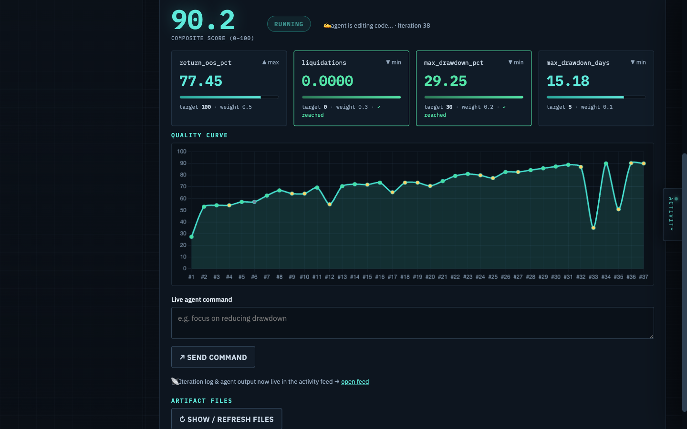
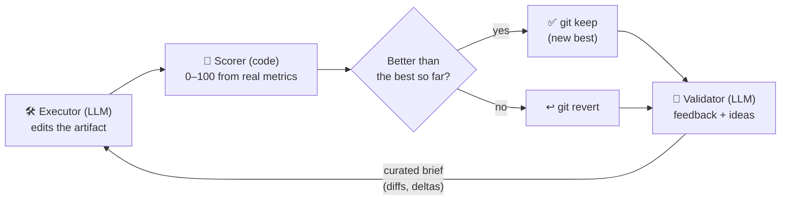
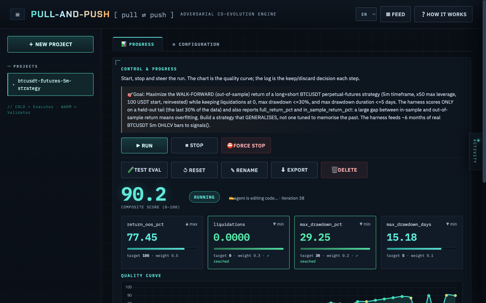
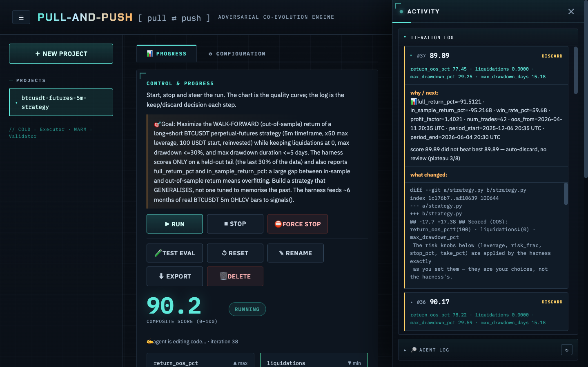
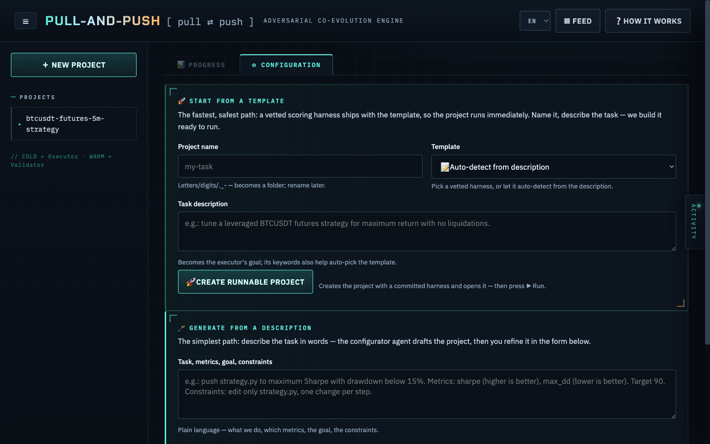
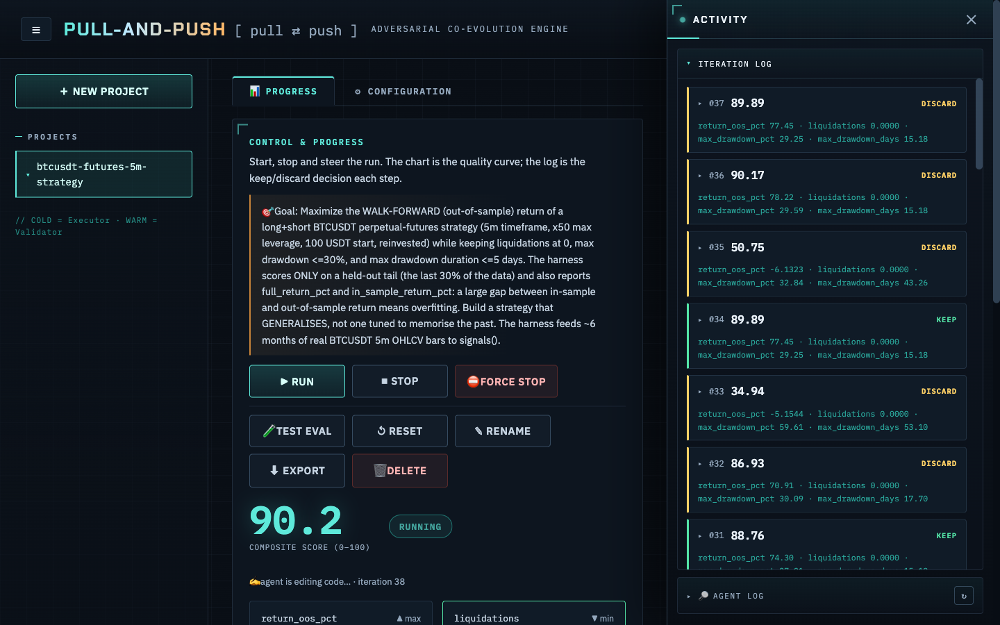

**English** · [Українська](README.uk.md) · [Русский](README.ru.md)

# Pull-and-Push

An **adversarial co-evolution orchestrator**: it runs two off-the-shelf agent CLIs in
opposition to drive a project to maximum quality. One agent improves an artifact; the
other evaluates it. They iterate — keep-if-better — until quality plateaus or hits a
target. The hardened artifact is the deliverable; the loop is the engine.

Inspired by GANs, Karpathy's `autoresearch`, and the `consilium` adapter pattern.

- **Design spec:** `docs/superpowers/specs/2026-06-03-tyani-tolkai-design.md`
- **Plan:** `docs/superpowers/plans/2026-06-03-tyani-tolkai-core-mvp.md`



> A real run: the deterministic scorer measures each candidate on a 0–100 scale, the
> executor keeps improving, and **keep-if-better** ratchets the score from a baseline up
> toward the target. The dip near iteration #33 is the loop escaping a local optimum.

## How it works



The **artifact** (the thing being improved) lives in git; the **scorer/harness** lives
*outside* it so the executor can't grade its own exam. Every iteration: edit → score →
keep-if-better → review → repeat, until the score hits the target or plateaus. The
hardened artifact is the deliverable.

## Screenshots

| Live control & progress | Activity feed (newest-first) |
|---|---|
|  |  |
| Composite score, per-metric cards (with their goals), and the quality curve. | A collapsible right rail: every iteration is a card (verdict-coloured), the validator's review and the executor's output render as Markdown. |

| Start a project in one step | Whole workspace |
|---|---|
|  |  |
| Pick a vetted template (ships a working scorer) **or** generate a project from a plain-language description. | Sidebar of projects, the live dashboard, and the activity rail — all in one screen. |

## Core ideas

- **Two axes:** competition mode (*asymmetric* Executor↔Validator | *symmetric* Rival↔Rival —
  later) × pluggable agent engine per role (`claude` / `codex` / `opencode` / `agy`).
- **No bespoke agents.** Every role is an off-the-shelf CLI agent; we only build code we
  control (orchestrator, scorer, metric runner, state, web).
- **The number comes from code, the LLM only advises.** A deterministic Scorer computes
  the 0–100 score from objective metrics; the Validator LLM gives text feedback only.
- **Hill-climbing via git** + a curated *iteration brief* with the real diff of past attempts.
- **You never invent a zero-point.** Give each metric a *direction* and a *target*; the
  system pins the scale's zero to the first measurement (0 = where you started, 100 = goal).
- **Walk-forward scoring (anti-overfit).** Where it matters — e.g. the trading template —
  the scorer measures on a *held-out out-of-sample tail*, not the data the executor tuned
  on, and reports the in-sample↔OOS gap. The loop optimises for generalisation, not
  memorisation — the line between a professional result and an overfit one.

## Install

```bash
python3.12 -m venv .venv
.venv/bin/pip install -e ".[dev]"      # includes web deps (fastapi/uvicorn/httpx)
.venv/bin/pytest                       # full suite passes (1 docker test skipped)
```

## Configuration & troubleshooting

**Cost cap** — set `limits.usd_per_mtok` (price) and `limits.budget_usd` (cap) in the config (or the
form's Budget/Price fields) to hard-stop a run at an estimated spend. The estimate is rough (CLI
agents don't report exact tokens) — a safety cap, not an invoice; the live status shows `≈ $X.XX`.

**Human checkpoints** — enable `checkpoints.on_target` / `on_plateau` / `every_n` to PAUSE for your
review (status *awaiting_review*) instead of finishing; the dashboard shows **Continue** / **Accept
& finish**. (For a *target* checkpoint, raise the target score first if you want to push further.)

**Stable scoring** — set `evaluation.runs: 3` to take the median of N measurements (flaky scorers),
and `evaluation.revalidate_every: N` to periodically re-check the best and demote a noise/fluke win.

**Untrusted generated code** — `sandbox.backend: local` runs the scorer on your host (fast, for code
you trust). For code you don't fully trust, use `sandbox.backend: docker` to isolate execution.

**Environment (optional)** — nothing secret is needed to start:

| Variable | Purpose |
|----------|---------|
| `TYANI_TOLKAI_WEB_PASSWORD` | If set, the dashboard requires `?token=<value>`. Leave empty for localhost. |
| `TYANI_TOLKAI_HOME` | Where projects live (default `~/.tyani-tolkai`). |

**Agents authenticate themselves** — Pull-and-Push shells out to whichever CLI a project names; no
API keys live here. Install and log in the engines you use: `claude` (Anthropic), `codex` (OpenAI),
`opencode`, `agy` (Google/Antigravity). Tip: use **different** providers for executor vs validator
on non-trivial runs — same model = correlated review blind spots.

**Portable scorer commands** — template commands use a `{python}` placeholder (e.g.
`{python} ../metrics/run_backtest.py`) that the runner replaces with the sandbox interpreter, so
projects run on hosts that only have `python3` (not a bare `python`).

**Common issues**

| Symptom | Fix |
|---------|-----|
| `claude: not found` / agent missing | Install + log in that CLI, or change the engine in the project's config. |
| Rate-limited / quota hit | The run pauses (status `paused`); press **▶ Run** again to resume from the last best. |
| Agent repeats `no_op` (no change) | Brief too vague or the file isn't the editable one — tighten the executor goal/task. |
| A step never ends | Lower `limits.step_seconds` (per-agent timeout), or use **⛔ Force Stop**. |
| `FileNotFoundError: 'python'` | The scorer command hardcodes `python` — use `{python}` (auto-substituted). |
| Dashboard empty after a restart | Select the project — its history loads from `state.db`. |
| Noisy/flaky scorer | Set `evaluation.runs: 3` — the runner takes the median of N measurements. |

## Quick start — the dashboard

```bash
.venv/bin/pull-and-push web            # open the printed URL (tyani-tolkai also works)
```

- 🚀 **Start from a template** *(recommended)* — the research + scaffold phase. Pick a vetted
  template (or let it auto-detect from your description), name the project, and it is created
  **ready to run**: a real, committed scoring harness lands in `metrics/` (outside the artifact,
  so the executor can't see or edit it), your description becomes the executor's goal. No
  hand-authored scorer, nothing to fix before the first **Run**. Templates today:
  `btcusdt-futures` (leveraged BTCUSDT 5m backtest) and `pytest-pass` (make a hidden test suite pass).
- 🪄 **Generate from a description** — describe the task in plain language; a configurator
  agent drafts the whole project, you review it in the form, then **Create**.
- ▶ **Run** drives the real agents; the quality curve, metric cards, iteration log and the
  **🔎 agent log** (the executor's real output) update live.
- ⛔ **Force Stop** kills the agent instantly; **Stop** waits for the iteration boundary.
- ⬇ **Export** downloads the **result as a `.zip`** (artifact code + `README.md` + `RESULTS.md`).
- **UI languages:** English (default) · Ukrainian · Russian — switch in the header; the
  choice and your place in the UI are remembered across reloads.
- Optional **completion webhook**: call your URL (GET/POST) when a run finishes.

## Real run (your own task, real agents)

Write a `config.yaml` (see `tests/fixtures/example_config.yaml`):

```yaml
project: my-task
mode: asymmetric
agents:
  executor:  { engine: claude, timeout: 600 }
  validator: { engine: codex,  timeout: 300 }   # a different provider (anti-collusion)
roles:
  executor:  { goal: "Make all tests pass.", task: "Edit src/ only." }
  validator: { goal: "Say why the score moved; one concrete next step." }
seed: { copy: ~/path/to/starting/code }       # empty | copy:<path>
evaluation:
  adapter: pytest-pass                         # numeric | command-exit | pytest-pass
  # 'worst' (the score-0 point) is optional — pinned to the first measurement.
  metrics: [ { name: pass_pct, dir: higher, weight: 1, target: 100 } ]
  target_score: 100
  harness_dir: metrics/                        # hidden tests, invisible to the executor
limits: { max_iterations: 30, plateau_N: 6, step_seconds: 600 }
sandbox: { backend: local }                    # docker | local
notify: { enabled: false, url: null, method: POST }   # completion webhook (optional)
```

```bash
.venv/bin/pull-and-push run config.yaml          # drives the real agents
.venv/bin/pull-and-push run config.yaml --resume # continue after a stop / limit
```

## Projects

```bash
pull-and-push projects list
pull-and-push projects export my-task --to my-task.zip    # portable + the result deliverable
pull-and-push projects import my-task.zip --to copy-1      # continue on another machine
pull-and-push projects reset my-task                       # back to seed, keep config
pull-and-push projects rename my-task --to renamed
pull-and-push projects delete renamed
```

## Notes & boundaries (honest)

- **Headless agents** run with permission to use their file tools and a detached stdin, so
  they can't hang on an interactive prompt (`claude`/`opencode`/`agy` get
  `--dangerously-skip-permissions`; `codex exec` is sandboxed and non-interactive). A
  per-step timeout is the final backstop.
- **Executor engine compatibility:** the loop runs each agent with `cwd = artifact/`.
  `claude` and `codex` respect that; `opencode`/`agy` currently resolve their own root and
  may edit the enclosing repo — **use `claude` or `codex` as the Executor** for now.
- **Symmetric mode** (Rival↔Rival + arena) — designed, not yet built.
- **Docker backend** is implemented; the `local` backend is fully tested. Keep metric
  commands simple (avoid shell pipes) for cross-backend parity.
- **WebUI auth** is a token in a URL query param — fine for localhost single-user; front it
  with a TLS reverse proxy for remote exposure.

## Tests

The full suite passes (1 docker test skipped), run on Python 3.10 & 3.12 in CI — unit (scorer, config, state, metrics, brief, registry, sandbox),
integration (orchestrator with mock + validator, baseline zero-point, force-stop, missing-
metric handling), CLI adapter (incl. headless flags + kill), projects round-trip (zip),
WebUI endpoints (incl. force-stop, agent-log, webhook), and a golden run proving
convergence with the harness left untouched (anti-collusion).
