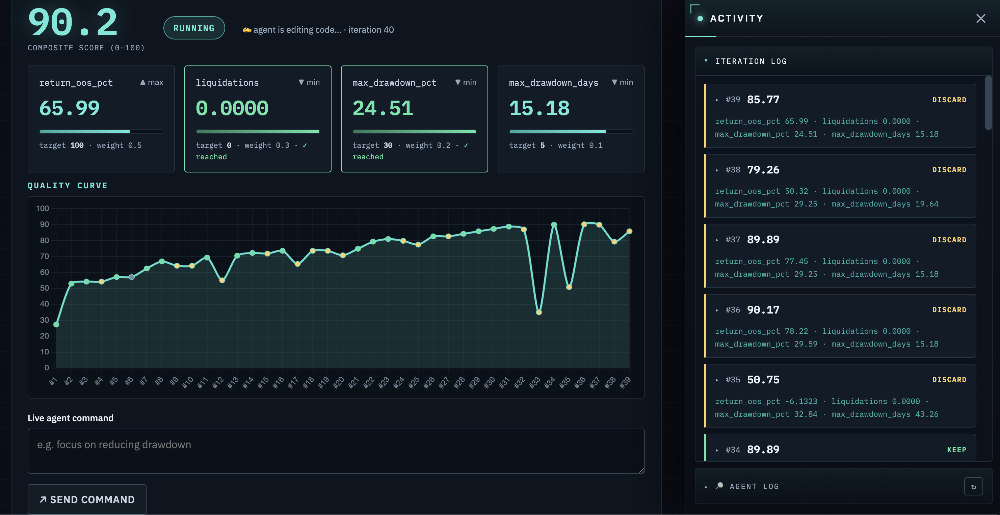
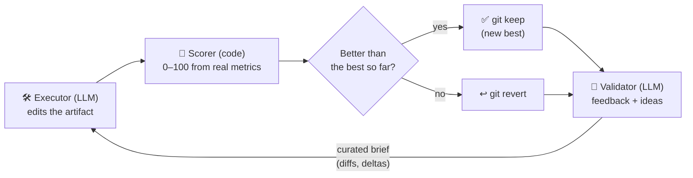
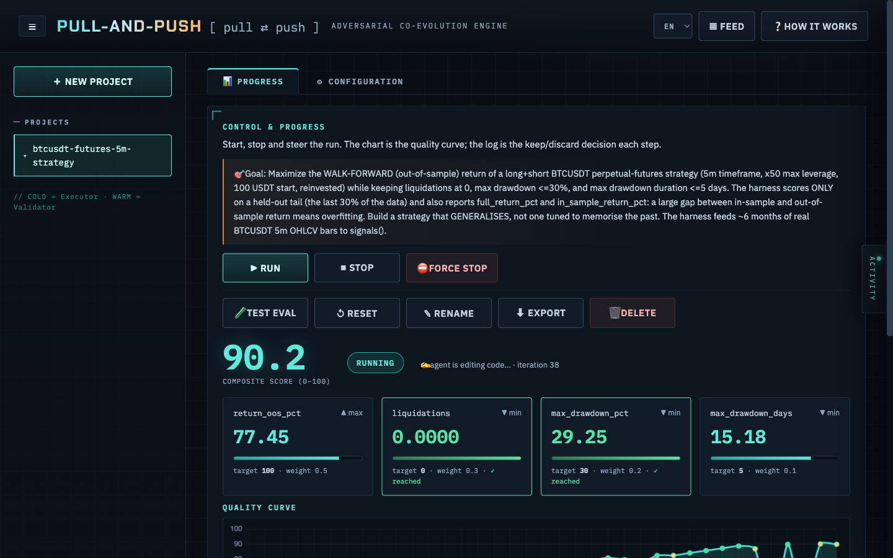
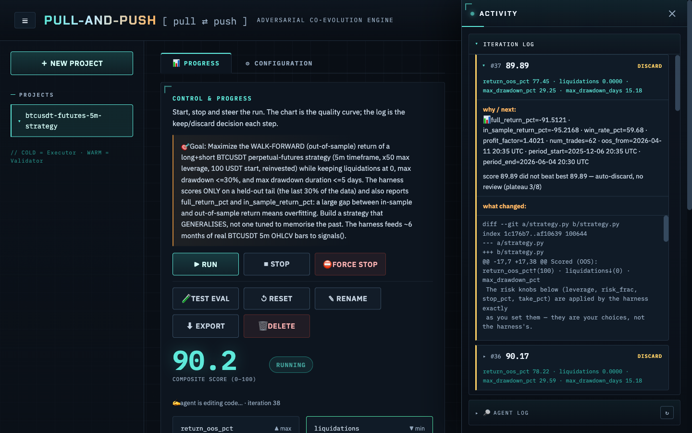
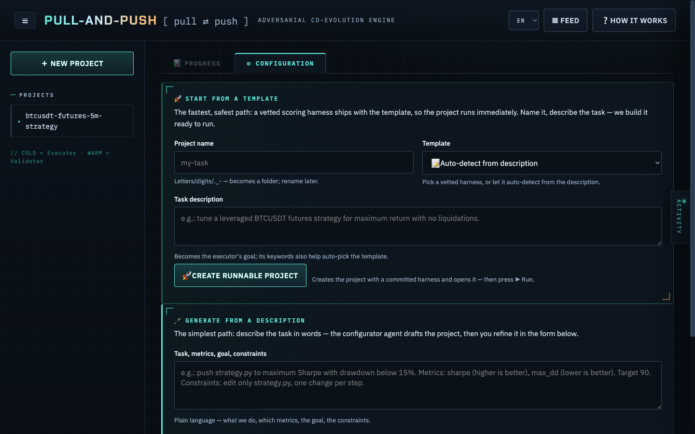
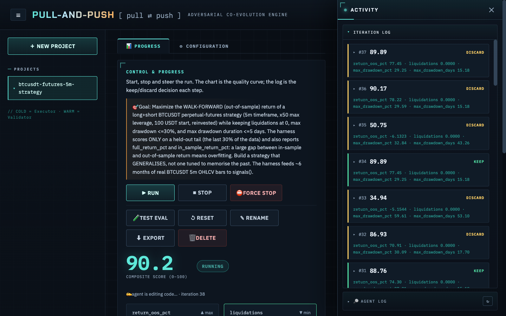
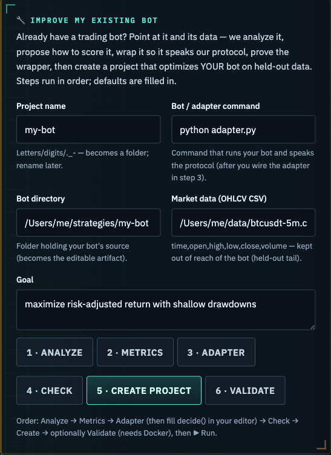
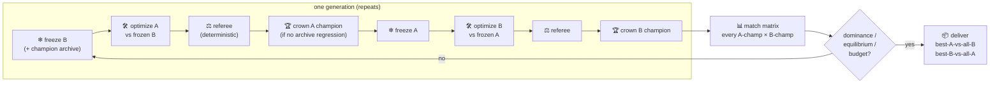

**English** · [Українська](README.uk.md) · [Русский](README.ru.md)

# Pull-and-Push

**Two AIs push each other to make your work better — automatically.**

One AI rewrites the thing you want improved. A small piece of code grades the result from
0 to 100 — honestly, from real numbers, not opinions. A second AI reads the result and
points out what's weak and what to try next. Then the loop runs again. Every round it keeps
the best version so far and throws the rest away. After a few hundred rounds you get
something far better than the first try — and you can watch every step happen live.

**Where it helps** — anything you can put a number on:

- a trading strategy that should earn more without getting wiped out,
- code that has to make a hidden test suite pass,
- a piece of writing you want to score higher against a rubric,
- any other experiment a script can score — faster or smaller code, a prompt, a config, SQL
  ([research kits](#any-experiment--research-kits)).

You bring the goal and a way to measure it. Pull-and-Push runs the thousands of small
attempts for you and hands back the best one.

**Get it:** on a Mac with Apple Silicon — [download the app](https://github.com/Lexus2016/Pull-and-Push/releases/latest) (signed, notarized, updates
itself from GitHub); anywhere else — [run it from source](#from-source-macos--linux--windows).



> A real run. The score starts low; the loop keeps improving and climbs toward the target,
> keeping the best version at every step. The dip near step #33 is the loop breaking out of
> a dead end and finding a better idea.

## How it works


```mermaid
flowchart LR
    E["🛠 Executor (LLM)<br/>edits the artifact"] --> S["📐 Scorer (code)<br/>0–100 from real metrics"]
    S --> K{"Better than<br/>the best so far?"}
    K -- yes --> G["✅ git keep<br/>(new best)"]
    K -- no --> R["↩ git revert"]
    G --> V["🔎 Validator (LLM)<br/>feedback + ideas"]
    R --> V
    V -- "curated brief<br/>(diffs, deltas)" --> E
```

The thing being improved lives in git, so any change can be undone instantly. The grader
lives *outside* it, so the AI can't peek at the answer key or mark its own homework. The
loop is plain: **edit → grade → keep if better → get feedback → repeat**, until the score
hits your target or stops improving. The best version is what you take away.

That is the default **asymmetric** mode (one artifact, a fixed objective). There is also a
**symmetric** mode — the **Co-Evolution Arena** — where *two* AIs co-evolve *two* competing
artifacts and a deterministic referee decides who wins each round. See
[Co-Evolution Arena](#co-evolution-arena-symmetric--rival--rival) below.

## Screenshots

| Live control & progress | Activity feed (newest-first) |
|---|---|
|  |  |
| Composite score, per-metric cards (with their goals), and the quality curve. | A collapsible right rail: every iteration is a card (verdict-coloured), the validator's review and the executor's output render as Markdown. |

| Start a project in one step | Whole workspace |
|---|---|
|  |  |
| Pick a vetted template (ships a working scorer) **or** describe an experiment in plain words — the 🧪 research wizard drafts the criteria, the judge and a starting version. | Sidebar of projects, the live dashboard, and the activity rail — all in one screen. |

| Improve an existing bot | |
|---|---|
|  | Onboard a bot you already have: analyze → propose metrics → scaffold + check an adapter → create the project, in six guided steps. The loop then optimises **your** bot on held-out data. |

## Under the hood (for builders)

The technical name is an **adversarial co-evolution orchestrator** — in the spirit of GANs,
Karpathy's `autoresearch`, and the `consilium` adapter pattern.

- **Off-the-shelf agents, no custom models.** Each role is an existing CLI agent
  (`claude` / `codex` / `opencode` / `agy` / `grok`). We only write the parts we fully control: the
  loop, the grader, the metric runner, the state store, and the web UI.
- **The number comes from code; the AI only advises.** A deterministic scorer computes the
  0–100 from objective metrics. The reviewer AI gives words and ideas — never the number.
- **Keep-if-better, tracked in git** — plus a short brief each round carrying the real diffs
  of past attempts, so the next try builds on the last instead of starting blind.
- **Fresh-look checkpoints.** Every 5th iteration both agents get a nudge to step back and
  re-examine the problem from the other side — questioning the core assumption instead of
  grinding one path into a local optimum.
- **You never invent a zero-point.** Give each metric a direction and a target; the scale's
  0 is pinned to your first measurement (0 = where you started, 100 = the goal).
- **Walk-forward scoring (no overfitting).** Where it matters — like the trading template —
  the grader measures on data the AI never tuned on, and shows the in-sample↔out-of-sample
  gap. That's the line between a result that holds up and one that only looked good on paper.
- **Two modes.** *Asymmetric* (above): one artifact vs a fixed objective. *Symmetric* — the
  [Co-Evolution Arena](#co-evolution-arena-symmetric--rival--rival): two artifacts co-evolve,
  judged by a deterministic referee, with a champion archive + match matrix. Same deterministic-
  judge principle; the referee is the trust anchor.

- **A local engine, a native app.** The engine is a FastAPI server on `127.0.0.1`. The macOS app
  wraps it in a native window with a bundled CPython and updates itself from GitHub Releases
  (Sparkle; the DMG and the feed are EdDSA-signed). The terminal CLI and the app share the same
  projects in `~/.tyani-tolkai/`.
- **Safe to leave running.** The API needs a token (swapped for a session cookie on the first
  visit), refuses foreign `Host` headers (DNS rebinding) and cross-origin writes (CSRF), and
  stopping the server stops its agents.

- **Design spec:** `docs/superpowers/specs/2026-06-03-tyani-tolkai-design.md`
- **Plan:** `docs/superpowers/plans/2026-06-03-tyani-tolkai-core-mvp.md`

## Install & run

### macOS app (Apple Silicon) — the easiest way

Download **`Pull-and-Push-0.4.2-arm64.dmg`** from
[Releases](https://github.com/Lexus2016/Pull-and-Push/releases/latest), open it, drag
**Pull-and-Push** into Applications and launch it. Python, the dependencies and the dashboard are
inside; the app is signed and notarized by Apple. You only need Git (the app offers to install the
Command Line Tools when it is missing) and, for real runs, an agent CLI (see below).

- **Updates itself from GitHub:** once a day it checks the latest release and offers *Install and
  Relaunch* (or **Pull-and-Push ▸ Check for Updates…**). Every update and the feed itself are
  EdDSA-signed; if research is running, the app asks first.
- Closing the window does not stop research: runs keep going and the Dock icon shows how many. When
  a run reaches its target, stops or waits for your decision, a **macOS notification** tells you
  (click it to open the project). **Quit** (⌘Q) stops the agents — it asks first when something runs.
- **⚙ Settings** (⌘,): agent CLIs with versions, the Python for scorers, updates, data folder, diagnostics.
- Same projects as the terminal: **`~/.tyani-tolkai/`**. If a dashboard already runs from the
  terminal (`./start.sh`), the app simply opens it — two dashboards never drive the same data.
- **File ▸ Install the pull-and-push Command** links the app's CLI into `~/.local/bin`: the
  terminal and agents work on the same projects, and `research start` finds the app's dashboard.
- Engine log: **File ▸ Open Engine Log** (`~/Library/Logs/Pull-and-Push/engine.log`).
- Scorers run on the bundled Python (standard library only). Need your own packages (numpy …)?
  Pick your Python in **⚙ Settings ▸ Python for scorers**.
- Build it yourself: `macos/build.sh` (`--ad-hoc`: no certificate, this Mac only). Check a built
  app without a screen: `macos/selftest.sh`.

### From source (macOS / Linux / Windows)

You need **Python 3.10+** (CPython, not PyPy) and **Git**. To run a real optimization you
also need one AI agent CLI (see the bottom of this section).

```bash
git clone https://github.com/Lexus2016/Pull-and-Push.git
cd Pull-and-Push
./start.sh
```

On **Windows**, use the PowerShell launcher instead of the last line:

```powershell
powershell -ExecutionPolicy Bypass -File .\start.ps1
```

`start.sh` (macOS/Linux) and `start.ps1` (Windows) create the virtualenv, install everything,
and print the dashboard's link (**http://127.0.0.1:8765/?token=…**). The dashboard is token-protected:
the link signs your browser in once, after that the plain address is enough (lost it?
`pull-and-push url --open`). It is re-runnable — pass `--port 8080` to use another port, or
`--update` to reinstall after a `git pull`. Then, in the browser: **🚀 New project from an
example** → pick a card → name it → describe the goal → **Create** → press **▶ Run**.

To run a *real* optimization you need one AI coding CLI (no API keys are stored here):
install and log in to **claude** (Anthropic), **codex** (OpenAI), **grok** (xAI), **opencode** or
**agy**, then pick it in the project. Tip: use *different* providers for the executor and the validator.

<details><summary><b>Prefer to install by hand (or on Windows)?</b></summary>

```bash
python3.12 -m venv .venv           # any CPython 3.10+ works (not PyPy)
source .venv/bin/activate          # Windows: .venv\Scripts\activate
pip install -e ".[web]"
pull-and-push web                  # then open the printed URL (default http://127.0.0.1:8765)
```

Run the tests: `pip install -e ".[dev]"` then `pytest` (493 pass; the 8 Docker tests skip when no Docker daemon is running).

</details>

## Updating (your projects are safe)

Your projects — config, run history, scores and the artifact — live in **`~/.tyani-tolkai/`**
(override with `TYANI_TOLKAI_HOME`), **outside** this repo. So updating the code never touches them.

**The macOS app updates itself:** once a day it checks GitHub Releases and offers *Install and
Relaunch* (or **Pull-and-Push ▸ Check for Updates…**); if research is running, it asks first.
**From source**, the dashboard shows a **⬆ vX** badge when a new release is out (the daily check
can be switched off in ⚙ Settings) — then:

```bash
cd Pull-and-Push
git pull
./start.sh --update     # reinstall deps + relaunch · Windows: powershell -ExecutionPolicy Bypass -File .\start.ps1 --update
```

- **No data loss.** Old project databases are migrated **in place** on first open (new columns added
  idempotently), so projects you ran on an older version keep working — open one and continue.
- **Scores stay honest across the upgrade.** If you changed a project's metrics/targets, the next
  **▶ Run** automatically re-scores its whole history onto the new metric scale (one consistent
  0–100 scale; the log notes `♻ objective changed → re-scored …`).
- **Optional backup** before a big jump: `cp -r ~/.tyani-tolkai ~/.tyani-tolkai.bak` (Windows: copy
  the `%USERPROFILE%\.tyani-tolkai` folder).

## Configuration & troubleshooting

**Cost cap** — `limits.budget_usd` (the form's Budget field) hard-stops a run when the spend reaches
it. claude and grok report each call's dollar cost; codex, agy and some opencode models report only
tokens — set `limits.usd_per_mtok` (Price) to price them (cache reads count at 10%). The live status
shows `$X.XX` when every call reported its own cost, and `≈ $X.XX` when part of it was priced from
tokens at `usd_per_mtok` or estimated.

**Human checkpoints** — enable `checkpoints.on_target` / `on_plateau` / `every_n` to PAUSE for your
review (status *awaiting_review*) instead of finishing; the dashboard shows **Continue** / **Accept
& finish**. (For a *target* checkpoint, raise the target score first if you want to push further.)

**Stable scoring** — set `evaluation.runs: 3` to take the median of N measurements (flaky scorers),
and `evaluation.revalidate_every: N` to periodically re-check the best and demote a noise/fluke win.

**Untrusted generated code** — `sandbox.backend: local` runs the scorer on your host (fast, for code
you trust). For code you don't fully trust, use `sandbox.backend: docker` to isolate execution.

**Environment (optional)** — nothing secret is needed to start:

| Variable | Purpose |
|----------|---------|
| `TYANI_TOLKAI_WEB_PASSWORD` | Use this dashboard token instead of the generated one (`~/.tyani-tolkai/web-token`). |
| `TYANI_TOLKAI_HOME` | Where projects live (default `~/.tyani-tolkai`). |
| `PULL_AND_PUSH_PYTHON` | The interpreter `{python}` means for scorers (overrides ⚙ Settings ▸ Python for scorers). |

**Agents authenticate themselves** — Pull-and-Push shells out to whichever CLI a project names; no
API keys live here. Install and log in the engines you use: `claude` (Anthropic), `codex` (OpenAI),
`grok` (xAI Grok Build: `curl -fsSL https://x.ai/cli/install.sh | bash`), `opencode`, `agy`
(Google/Antigravity). **Reasoning effort:** every agent in every role reasons at `medium` by
default — the loop is many short steps, and a long think on one step only slows it (on its own
"high", Grok spent a whole 10-minute turn reasoning without touching a file). Raise it per agent:
`agents: {executor: {engine: claude, effort: high}}` (claude/agy `--effort`, grok
`--reasoning-effort`, codex `model_reasoning_effort`, opencode `--variant`). Tip: use **different** providers for executor vs validator
on non-trivial runs — same model = correlated review blind spots.

**Agents without your personal setup, and their real cost.** Every agent in the loop starts without
your personal configuration: claude without your hooks and skills, codex without your MCP servers,
grok without the Claude/Codex rules it would import, opencode without plugins and `~/.claude` rules
(agy has no such switch: it still reads your `GEMINI.md` and MCP servers). Every engine streams JSON,
so the live log shows one line per action and the spend is what the CLI itself reported. Every
executor action outside the artifact folder (where the judge lives) is marked `⚠` in the log,
recorded on the iteration and explained to the executor in its next brief — it cannot be blocked
without an OS sandbox: in a live check grok searched the disk, found the arena referee's source and
read the answer.

**Portable scorer commands** — template commands use a `{python}` placeholder (e.g.
`{python} ../metrics/run_backtest.py`) that the runner replaces with the sandbox interpreter, so
projects run on hosts that only have `python3` (not a bare `python`). Which interpreter that is —
the bundled one or your own with numpy/pandas — is chosen in **⚙ Settings ▸ Python for scorers**.

**Common issues**

| Symptom | Fix |
|---------|-----|
| `claude: not found` / agent missing | Install + log in that CLI (⚙ Settings shows what is found and the install command), or change the engine in the project's config. The macOS app reads your login shell's `PATH` at launch — restart it after installing. |
| The dashboard asks you to sign in | Open the link printed by `pull-and-push web`, or run `pull-and-push url --open`. |
| Rate-limited / quota hit | The run pauses (status `paused`); press **▶ Run** again to resume from the last best. |
| Agent repeats `no_op` (no change) | Brief too vague or the file isn't the editable one — tighten the executor goal/task. |
| A step never ends | Lower `limits.step_seconds` (per-agent timeout), or use **⛔ Force Stop**. |
| `FileNotFoundError: 'python'` | The scorer command hardcodes `python` — use `{python}` (auto-substituted). |
| Dashboard empty after a restart | Select the project — its history loads from `state.db`. |
| Noisy/flaky scorer | Set `evaluation.runs: 3` — the runner takes the median of N measurements. |
| Score dropped after I changed the metrics | Expected — the loop **re-baselined**: it re-measured the current best under the *new* objective so comparisons stay fair (a genuine improvement on the new scale won't be discarded against the old bar). The artifact didn't get worse; the scale did. Logged in the agent log. |

## Quick start — the dashboard

```bash
.venv/bin/pull-and-push web            # open the printed URL (tyani-tolkai also works)
```

- 🚀 **Start from a template** *(recommended)* — the research + scaffold phase. Pick a vetted
  template (or let it auto-detect from your description), name the project, and it is created
  **ready to run**: a real, committed scoring harness lands in `metrics/` (outside the artifact,
  so the executor can't see or edit it), your description becomes the executor's goal. No
  hand-authored scorer, nothing to fix before the first **Run**. Templates today:
  `btcusdt-futures` (leveraged BTCUSDT 5m backtest), `pytest-pass` (make a hidden test suite pass)
  and `custom` (a minimal scorer to adapt to your task).
- 🧪 **Research from an idea** — describe any measurable experiment in plain language; a helper
  agent asks what it needs, then drafts the whole research kit (goal, criteria, hard constraints,
  the scorer and a starting version); you review it, a pre-flight runs the judge, then **Create**.
  See [Any experiment — research kits](#any-experiment--research-kits).
- 🔧 **Improve my existing bot** — onboard a bot you already have (analyze → metrics → adapter →
  check → create), so the loop optimises *your* bot on held-out data. Full walkthrough:
  [Improve an existing bot](#improve-an-existing-bot-onboarding).
- ▶ **Run** drives the real agents. The quality curve and metric cards update live, alongside a
  collapsible **activity feed** (right rail, newest iteration on top): the validator's review and
  the executor's output render as **Markdown**. Your layout — feed open/closed, sidebar, current
  project and tab — is remembered across reloads.
- 📈 **Switchable chart** — by default it draws the composite **quality curve**. Click any **metric
  card** to chart that metric's real value across the whole run (the axis auto-scales to its units);
  click the **composite score** to switch back. Points stay coloured by verdict, and the chart keeps
  updating live during a run.
- ⛔ **Force Stop** kills the agent instantly; **Stop** waits for the iteration boundary.
- ⬇ **Export** downloads the current best **result as a `.zip`** (artifact code + `README.md` + `RESULTS.md`).
- ⚙ **Settings & diagnostics** — agent CLIs with versions (and the install command for a missing
  one), the Python for scorers, updates, the data folder, security; **Copy diagnostics** for a bug
  report.
- 🔒 **Sign-in** — the printed link carries a token once; the browser keeps a session cookie and the
  plain address works afterwards (`pull-and-push url --open` prints/opens the link again).
- **UI languages:** English · Ukrainian · Russian — switch in the header (with styled tooltips on
  every control). The first visit follows your browser's language; in the macOS app the menus follow
  the switch too. The choice and your place in the UI persist across reloads.
- Optional **completion webhook**: call your URL (GET/POST) when a run finishes; the macOS app also
  shows a notification.

### Snapshots — download, rewind to, or fork any iteration

The highest composite score isn't always the version you want; an intermediate iteration can be
more interesting (say, higher `return_oos_pct` at a slightly lower weighted score). Every **kept**
iteration in the activity feed is a real git commit, so each keep card carries three actions:

- **⬇ Download this version** — a runnable zip of the artifact *at that iteration* (with the
  harness, config and a `SNAPSHOT.txt` noting that iteration's own score) — not just the latest.
- **↻ Continue from here** — rewind the project to that iteration: it becomes the current best, and
  the next **Run** continues from it (with whatever you refine). The dropped tail is tagged in git,
  so nothing is truly lost.
- **⑂ Fork to a new project** — branch that iteration into a separate project; the original stays
  untouched, so you can optimise both directions independently.

Snapshots are offered for **kept** iterations (each is a committed checkpoint); discarded
candidates are reverted and not stored. Rewind/fork are disabled while a run is in progress.

## Any experiment — research kits

Anything a script can score can be optimized: code speed or size, a prompt, a config, SQL, text
against a rubric, a strategy. An experiment is a **research kit** — `research.yaml` (goal, what may
be edited, metrics, hard constraints, target, budget) + `seed/` (the starting version) + `scorer/`
(the judge, invisible to the executor). **Hard constraints** (`constraints: [{name, min, max}]`)
keep a version out no matter how well it scores — "faster, but always correct". A **pre-flight**
runs the judge on the seed twice before any agent is paid (crashes, missing or NaN metrics, noise,
a seed that already meets the target).

```bash
pull-and-push research new    my-research                 # runnable skeleton to edit
pull-and-push research check  examples/research/fast-primes
pull-and-push research create examples/research/fast-primes --name my-primes
pull-and-push research start  my-primes                  # in the running dashboard, else here
pull-and-push status my-primes && pull-and-push report my-primes
pull-and-push research save   my-primes --to next-round --source best   # the next round
```

In the dashboard: **🧪 Research from an idea** (clarify → draft the kit → check the judge →
create); saved kits are reusable. Format and judge rules: [`docs/research-kits.md`](docs/research-kits.md).
Agents (Claude Code) drive the same flow with the skill in `skills/pull-and-push-research/`.

## Improve an existing bot (onboarding)

Already have a trading bot? Optimise **it** — not a template. The dashboard's **🔧 Improve my
existing bot** card (and the matching CLI) walk a safe, gated flow that wraps your bot, proves the
wrapper, then builds a project that tunes your bot on held-out data.


**In the dashboard** — press **＋ New project** and use the *Improve my existing bot* card: point at
your bot's folder, an OHLCV CSV and a goal, then walk the six steps (each shows its result/verdict):

1. **Analyze** — a read-only LLM pass produces a *bot profile* (entry point, tunables, risks).
2. **Metrics** — proposes how to score your bot (metrics + targets); you review and keep them.
3. **Adapter** — scaffolds `adapter.py` (vetted protocol plumbing + a `decide()` stub). **Fill in
   `decide()`** in your editor so it calls your bot's logic and returns a position (1 / 0 / -1).
4. **Check** — proves the adapter speaks the protocol: well-formed + deterministic + non-degenerate.
5. **Create project** — lays your bot into the artifact, the data into `metrics/` (out of the bot's
   reach), wires the vetted scorer, and opens the project.
6. **Validate** *(optional, needs Docker)* — the secondary-validation evidence report (control
   spectrum, determinism, anti-look-ahead, overfit gap) → **PASS / FLAG**.

Then press **▶ Run**.

**From the CLI** (the same flow, step by step):

```bash
pull-and-push profile       ./mybot --out ./mybot                       # → profile.json + .md
pull-and-push propose       ./mybot/profile.json --goal "max risk-adjusted return" --out ./mybot
pull-and-push gen-adapter   --bot-dir ./mybot                           # writes adapter.py — fill in decide()
pull-and-push check-adapter --bot-dir ./mybot --bot-cmd "python adapter.py"        # PASS / FLAG
pull-and-push onboard       --bot-dir ./mybot --data ./data.csv \
                            --proposal ./mybot/proposal.json --name my-bot --bot-cmd "python adapter.py"
pull-and-push validate      --bot-dir ./mybot --data ./data.csv --bot-cmd "python adapter.py" --seed my-bot
pull-and-push run           ~/.tyani-tolkai/projects/my-bot/config.yaml
```

**Why the wrapper + the gate?** The engine only ever trusts a vetted, hidden scorer — never code the
AI wrote. So your bot is never the judge: it runs **isolated** (Docker sandbox) and only emits
orders; our engine computes the PnL. `check-adapter` proves the wrapper is protocol-sound;
`validate`'s control spectrum then catches semantic mistakes (a sign-flip loses to flat/random).
Full rationale: [`docs/design/onboarding-existing-bots.md`](docs/design/onboarding-existing-bots.md).

## Real run (your own task, real agents)

Write a `config.yaml` (see `tests/fixtures/example_config.yaml`):

```yaml
project: my-task
mode: asymmetric
agents:
  executor:  { engine: claude, timeout: 600 }
  validator: { engine: codex,  timeout: 300 }   # a different provider (anti-collusion)
roles:
  executor:  { goal: "Make all tests pass.", task: "Edit src/ only." }
  validator: { goal: "Say why the score moved; one concrete next step." }
seed: { copy: ~/path/to/starting/code }       # empty | copy:<path>
evaluation:
  adapter: pytest-pass                         # numeric | command-exit | pytest-pass
  # 'worst' (the score-0 point) is optional — pinned to the first measurement.
  metrics: [ { name: pass_pct, dir: higher, weight: 1, target: 100 } ]
  target_score: 100
  harness_dir: metrics/                        # hidden tests, invisible to the executor
limits: { max_iterations: 30, plateau_N: 6, step_seconds: 600 }
sandbox: { backend: local }                    # docker | local
notify: { enabled: false, url: null, method: POST }   # completion webhook (optional)
```

```bash
.venv/bin/pull-and-push run config.yaml          # drives the real agents
.venv/bin/pull-and-push run config.yaml --resume # continue after a stop / limit
```

## Co-Evolution Arena (symmetric — Rival ↔ Rival)

The second mode co-evolves **two** artifacts, A and B, that compete against each other (a
red-team ↔ blue-team arms race — e.g. an anti-detect browser vs a bot-detector). Each side is
judged not by an objective number but by **how it performs against the other**, decided by a
deterministic, vetted **referee** — the trust anchor (never an LLM; neither side scores itself).
A thin orchestrator alternates generations, keeps a champion archive, tracks a match matrix, and
stops on dominance / equilibrium / budget. Design + convergence proof:
[`docs/design/p6-coevolution-arena.md`](docs/design/p6-coevolution-arena.md).


```mermaid
flowchart LR
    subgraph gen["one generation (repeats)"]
        FB["❄ freeze B<br/>(+ champion archive)"] --> OA["🛠 optimize A<br/>vs frozen B"]
        OA --> R1["⚖ referee<br/>(deterministic)"]
        R1 --> CA["🏆 crown A champion<br/>(if no archive regression)"]
        CA --> FA["❄ freeze A"] --> OB["🛠 optimize B<br/>vs frozen A"]
        OB --> R2["⚖ referee"] --> CB["🏆 crown B champion"]
    end
    CB --> M["📊 match matrix<br/>every A-champ × B-champ"]
    M --> ST{"dominance /<br/>equilibrium /<br/>budget?"}
    ST -- no --> FB
    ST -- yes --> D["📦 deliver<br/>best-A-vs-all-B<br/>best-B-vs-all-A"]
```

How it differs from the asymmetric loop, in plain terms:

- **The judge is a referee, not a fixed scorer.** It runs A's artifact against B's (in the
  sandbox) and emits an objective outcome. It is the **trust anchor** — deterministic, vetted,
  never an LLM, and neither side grades itself.
- **Inner loop reused, unchanged.** "Optimize A against a frozen B" is just the asymmetric loop
  with the referee wrapped as its metric — so all the Phase-1 machinery (git keep-if-better, the
  brief, resume) carries over. Symmetric mode is a thin layer on top.
- **Champion archive + match matrix.** Each side keeps a hall-of-fame; a new champion is crowned
  only if it doesn't regress against the *whole* opposing archive (the guard against
  rock-paper-scissors cycling). The arena's *true* standings come from the match matrix, not the
  inner score.
- **Two signals.** The curve you watch is the **stable** signal (each side vs a fixed validation
  set) — honest progress. The internal "beat the current opponent" signal is non-stationary and
  never plotted.
- **Winning is a stop rule, not the product.** The deliverables are the most *robust* champions:
  best-A-vs-all-B and best-B-vs-all-A.

The shipped referee (`cegis-recognizer`) is a **toy with a checkable fixpoint** that *proves the
machinery converges* (it does not merely cycle) before any real domain — that proof runs in CI on
deterministic stand-in rivals, no API needed.

```yaml
project: arena-task
mode: symmetric
agents:
  rival_a: { engine: claude, timeout: 600 }     # writes artifact A (must write to cwd)
  rival_b: { engine: codex,  timeout: 600 }     # writes artifact B (mix providers)
roles:
  rival_a: { goal: "recognize the hidden target" }
  rival_b: { goal: "produce inputs A misclassifies" }
evaluation:                                       # for symmetric the metric is fixed:
  adapter: numeric
  command: x
  metrics: [ { name: arena_fitness, dir: higher, target: 1.0, worst: 0.0 } ]
arena:
  referee: cegis-recognizer                       # name from the vetted referee registry
  generations: 20
  per_generation_iterations: 8
  dominance_tau: 0.95
sandbox: { backend: docker }                       # referee runs untrusted code — isolate it
limits: { budget_usd: 5.0, usd_per_mtok: 3.0 }     # symmetric DOUBLES cost — cap it
```

```bash
.venv/bin/pull-and-push run arena.yaml            # alternating co-evolution; re-run = resume / no-op
```

In the **WebUI** pick *Mode → symmetric* in the manual form (rival engines + referee +
generations), then watch the live **dual stable-curve** (A vs B), the champion counts, and the
deliverables (best-A-vs-all-B / best-B-vs-all-A). Stop halts it after the current side's turn; on resume an unfinished generation is replayed.

To take it to a **real domain**, implement the `Referee` protocol
(`src/tyani_tolkai/arena/referee.py`) and register it — the arena machinery is domain-agnostic.
See [`SECURITY.md`](SECURITY.md): the referee executes one side's untrusted code, so isolate it
(`sandbox.backend: docker`).

## Projects

```bash
pull-and-push projects list
pull-and-push projects export my-task --to my-task.zip    # portable + the result deliverable
pull-and-push projects import my-task.zip --to copy-1      # continue on another machine
pull-and-push projects reset my-task                       # back to seed, keep config
pull-and-push projects rename my-task --to renamed
pull-and-push projects delete renamed
pull-and-push url --open                                   # the running dashboard's sign-in link
```

## Notes & boundaries (honest)

- **Headless agents** run with permission to use their file tools and a detached stdin, so
  they can't hang on an interactive prompt (`claude`/`agy` get `--dangerously-skip-permissions`;
  `opencode run` is non-interactive by itself; `codex exec` is sandboxed and non-interactive). A
  per-step timeout is the final backstop.
- **Executor engine compatibility** (verified by smoke-test): the loop pins each engine to the
  artifact dir with its own flag — `claude` (cwd) · `codex -C` · `opencode --dir` · `agy --add-dir` · `grok --cwd`.
  **`claude`, `codex`, `opencode`, `agy` and `grok` work** as Executor/Validator (each edits only the
  artifact). `agy` was marked "not recommended" until v0.4.2 — the loop launched it as
  `agy -p --dangerously-skip-permissions …`, and agy ≥ 1.2 reads the word after `-p` as the prompt,
  so it ignored the task. The prompt now goes into `--print`; verified with agy 1.2.13 (a bug fix
  in a file, a JSON helper answer, a real research iteration). It has the fewest long runs behind
  it — for a long unattended run, `claude` / `codex` are the proven pair. `grok` (xAI Grok Build,
  from v0.4.2) runs with `--always-approve` as Executor and with Write/Edit/Bash denied as reviewer
  or helper (checked with a write-bait). Every engine reasons at `medium` by default (from v0.4.3):
  on its own "high", one Grok turn reasoned for the whole 10-minute timeout. From v0.5.0 any engine
  can also be an arena rival.
- **Symmetric mode** (Rival↔Rival + arena) — **shipped** (CLI + WebUI dual-curve, persist/resume,
  Stop, budget cap). Proven to converge on a toy referee with a checkable fixpoint; a real-domain
  referee + a real-LLM end-to-end run are the next step (the machinery is domain-agnostic). The
  Docker sandbox for the referee is implemented but its live run is not yet CI-validated.
- **Docker backend** is implemented; the `local` backend is fully tested. Keep metric
  commands simple (avoid shell pipes) for cross-backend parity.
- **WebUI auth**: a token (stable, `~/.tyani-tolkai/web-token`) traded on the first visit for an
  HttpOnly, SameSite=Strict session cookie; on loopback, foreign `Host` headers and cross-origin
  writes are refused. For remote access put a TLS reverse proxy in front (`--host 0.0.0.0` turns the
  Host check off; `--no-auth` drops the token — not advised).

## Tests

The full suite passes (the Docker tests skip without a daemon), run on Python 3.10 & 3.12 in CI (Linux and Windows; on macOS before every release, `macos/release.sh`) — unit (scorer, config, state, metrics, brief, registry, sandbox),
integration (orchestrator with mock + validator, baseline zero-point, force-stop, missing-
metric handling), CLI adapter (incl. headless flags + kill), projects round-trip (zip),
WebUI endpoints (incl. force-stop, agent-log, webhook, auth, settings), a golden run proving
convergence with the harness left untouched (anti-collusion), and the macOS app's headless
self-test (`macos/selftest.sh`, before every release): the dashboard inside the app's own WebView, the native
bridge, downloads, language switching, the signed update feed, and the engine stopping with the app.
