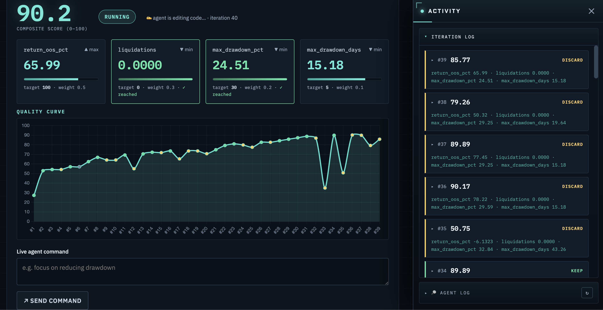
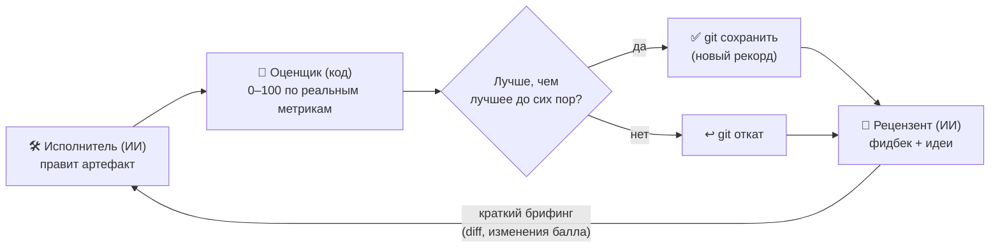

[English](README.md) · [Українська](README.uk.md) · **Русский**

# Pull-and-Push

**Два искусственных интеллекта подталкивают друг друга, чтобы сделать твою работу лучше — автоматически.**

Один ИИ переписывает то, что ты хочешь улучшить. Небольшой кусок кода оценивает результат от
0 до 100 — честно, по реальным числам, а не «на глаз». Второй ИИ читает результат и говорит,
что слабое и что попробовать дальше. Потом цикл повторяется. Каждый раз он оставляет лучшую
версию, а остальное отбрасывает. За несколько сотен кругов выходит что-то намного лучше первой
попытки — и ты видишь каждый шаг вживую.

**Где это помогает** — всё, что можно измерить числом:

- торговая стратегия, которая должна зарабатывать больше и не «слить» депозит,
- код, который должен пройти скрытый набор тестов,
- текст, который нужно поднять по оценке по рубрике.

Ты задаёшь цель и способ её измерить. Pull-and-Push делает за тебя тысячи мелких попыток и
возвращает лучшую.



> Реальный прогон. Балл стартует низко; цикл улучшает и поднимается к цели, оставляя лучшую
> версию на каждом шаге. Провал около шага №33 — это цикл выбирается из тупика и находит
> идею получше.

## Как это работает



То, что улучшаем, лежит в git — поэтому любое изменение можно мгновенно откатить. Оценщик
лежит *снаружи*, поэтому ИИ не может подсмотреть ответы или поставить оценку сам себе. Цикл
простой: **править → оценить → оставить, если лучше → получить фидбек → повторить**, пока балл
не достигнет цели или не перестанет расти. Лучшая версия — это то, что ты забираешь.

## Скриншоты

| Управление и прогресс вживую | Лента активности (новое сверху) |
|---|---|
|  |  |
| Композитный балл, карточки метрик (с их целями) и кривая качества. | Сворачиваемая панель справа: каждая итерация — карточка (цвет по вердикту), обзор рецензента и вывод исполнителя рендерятся как Markdown. |

| Создать проект за один шаг | Всё рабочее пространство |
|---|---|
|  |  |
| Выбери проверенный шаблон (идёт с готовым оценщиком) **или** сгенерируй проект из обычного описания. | Список проектов, живая панель и лента активности — всё на одном экране. |

## Под капотом (для тех, кто строит)

Техническое название — **оркестратор состязательной ко-эволюции** (в духе GAN, `autoresearch`
Карпаты и паттерна адаптеров `consilium`).

- **Готовые агенты, без своих моделей.** Каждая роль — существующий CLI-агент
  (`claude` / `codex` / `opencode` / `agy`). Мы пишем только то, что полностью контролируем:
  сам цикл, оценщик, запуск метрик, хранилище состояния и веб-интерфейс.
- **Число даёт код, ИИ лишь советует.** Детерминированный оценщик считает 0–100 из
  объективных метрик. ИИ-рецензент даёт слова и идеи — никогда не число.
- **Оставлять, если лучше, с записью в git** — плюс короткий брифинг каждый круг с реальными
  diff прошлых попыток, чтобы следующая попытка опиралась на предыдущую, а не начинала вслепую.
- **Контрольные точки «свежего взгляда».** Каждую 5-ю итерацию оба агента получают толчок
  отступить и пересмотреть задачу с другой стороны — поставить под сомнение ключевое допущение,
  а не загонять один путь в локальный оптимум.
- **Ты никогда не выдумываешь ноль шкалы.** Задаёшь метрике направление и цель; ноль шкалы
  ставится по твоему первому замеру (0 = откуда начал, 100 = цель).
- **Walk-forward оценка (без переобучения).** Где это важно — как в торговом шаблоне —
  оценщик измеряет на данных, которых ИИ не видел при настройке, и показывает разрыв
  in-sample↔out-of-sample. Это граница между результатом, который держится, и тем, что лишь
  хорошо выглядел на бумаге.

- **Дизайн-спецификация:** `docs/superpowers/specs/2026-06-03-tyani-tolkai-design.md`
- **План:** `docs/superpowers/plans/2026-06-03-tyani-tolkai-core-mvp.md`

## Установка и запуск

Нужны **Python 3.10+** (CPython, не PyPy) и **Git**. Чтобы реально запустить оптимизацию,
дополнительно нужен один CLI ИИ-агента (см. конец раздела).

```bash
git clone https://github.com/Lexus2016/Pull-and-Push.git
cd Pull-and-Push
./start.sh
```

`start.sh` создаёт виртуальное окружение, всё устанавливает и открывает панель по адресу
**http://127.0.0.1:8765**. Скрипт можно запускать повторно — добавь `--port 8080`, чтобы
сменить порт, или `--update`, чтобы переустановить после `git pull`. Дальше в браузере:
**🚀 Новый проект из примера** → выбери карточку → дай название → опиши цель → **Создать** →
нажми **▶ Запуск**.

Чтобы запустить *реальную* оптимизацию, нужен один CLI для ИИ-кодинга (никаких API-ключей
здесь не хранится): установи и войди в **claude** (Anthropic), **codex** (OpenAI) или
**opencode**, затем выбери его в проекте. Совет: бери *разных* провайдеров для исполнителя и
валидатора.

<details><summary><b>Предпочитаешь установить вручную (или на Windows)?</b></summary>

```bash
python3.12 -m venv .venv           # подойдёт любой CPython 3.10+ (не PyPy)
source .venv/bin/activate          # Windows: .venv\Scripts\activate
pip install -e ".[web]"
pull-and-push web                  # затем открой напечатанный URL (по умолчанию http://127.0.0.1:8765)
```

Запустить тесты: `pip install -e ".[dev]"`, затем `pytest` (151 проходит, 1 docker-тест пропущен).

</details>

## Быстрый старт — панель

```bash
.venv/bin/pull-and-push web            # открой напечатанный URL (работает и tyani-tolkai)
```

- 🚀 **Старт из шаблона** *(рекомендуется)* — фаза ресёрча и scaffold. Выбери проверенный
  шаблон (или дай определить его из описания), назови проект — и он создаётся **готовым к запуску**:
  настоящий закоммиченный гарнес оценивания ложится в `metrics/` (вне артефакта, поэтому исполнитель
  его не видит и не редактирует), а твоё описание становится целью исполнителя. Никакого гарнеса
  вручную, ничего не нужно чинить перед первым **Запуском**. Шаблоны сейчас: `btcusdt-futures`
  (бэктест BTCUSDT 5m с плечом) и `pytest-pass` (пройти скрытый набор тестов).
- 🪄 **Сгенерировать из описания** — опиши задачу обычным языком; агент-настройщик составит
  весь проект, ты проверишь его в форме и нажмёшь **Создать**.
- ▶ **Run** запускает реальных агентов. Кривая качества и карточки метрик обновляются вживую
  рядом со сворачиваемой **лентой активности** (правая панель, новое сверху): обзор рецензента и
  вывод исполнителя рендерятся как **Markdown**. Раскладка (лента открыта/закрыта, боковая панель,
  текущий проект и вкладка) запоминается между перезагрузками.
- 📈 **Переключение графика** — по умолчанию рисуется композитная **кривая качества**. Кликни на
  любой **карточке метрики**, чтобы увидеть график её реального значения за весь прогон (ось
  автоматически масштабируется под единицы); кликни на **композитном балле**, чтобы вернуться.
  Точки остаются окрашенными по вердикту, и график обновляется вживую во время прогона.
- ⛔ **Force Stop** немедленно убивает агента; **Stop** ждёт границы итерации.
- ⬇ **Export** скачивает текущий best **как `.zip`** (код артефакта + `README.md` + `RESULTS.md`).
- **Языки интерфейса:** английский (по умолчанию) · украинский · русский — переключатель в
  шапке (со стилизованными тултипами на каждом контроле). Выбор и место в интерфейсе сохраняются.
- Опциональный **вебхук завершения**: дёрнуть твой URL (GET/POST), когда прогон завершится.

### Снимки — скачать, откатиться или форкнуть любую итерацию

Наивысший композитный балл — не всегда та версия, которую хочешь; промежуточная итерация бывает
интереснее (скажем, выше `return_oos_pct` при чуть меньшем взвешенном балле). Каждая **оставленная**
(keep) итерация в ленте — это настоящий git-коммит, поэтому на её карточке есть три действия:

- **⬇ Скачать эту версию** — запускаемый zip артефакта *именно на той итерации* (вместе с гарнесом,
  конфигом и `SNAPSHOT.txt` с собственным баллом этой итерации), а не только последний.
- **↻ Продолжить отсюда** — откатить проект к той итерации: она становится текущим best, и следующий
  **Run** продолжит с неё (с тем, что уточнишь). Отброшенный «хвост» тегается в git — ничего не теряется.
- **⑂ Форк в новый проект** — отвести ту итерацию в отдельный проект; оригинал нетронут, так что
  оптимизируешь оба направления независимо.

Снимки доступны для **keep**-итераций (каждая — закоммиченная контрольная точка); отброшенные
кандидаты откатываются и не хранятся. Откат/форк заблокированы во время прогона.

## Реальный прогон (твоя задача, реальные агенты)

Напиши `config.yaml` (см. `tests/fixtures/example_config.yaml`):

```yaml
project: my-task
mode: asymmetric
agents:
  executor:  { engine: claude, timeout: 600 }
  validator: { engine: codex,  timeout: 300 }   # другой провайдер (защита от «сговора»)
roles:
  executor:  { goal: "Сделать, чтобы все тесты проходили.", task: "Правь только src/." }
  validator: { goal: "Скажи, почему балл изменился; один конкретный следующий шаг." }
seed: { copy: ~/path/to/starting/code }       # empty | copy:<путь>
evaluation:
  adapter: pytest-pass                         # numeric | command-exit | pytest-pass
  # 'worst' (точка 0 баллов) опционален — ставится по первому замеру.
  metrics: [ { name: pass_pct, dir: higher, weight: 1, target: 100 } ]
  target_score: 100
  harness_dir: metrics/                        # скрытые тесты, невидимые исполнителю
limits: { max_iterations: 30, plateau_N: 6, step_seconds: 600 }
sandbox: { backend: local }                    # docker | local
notify: { enabled: false, url: null, method: POST }   # вебхук завершения (опционально)
```

```bash
.venv/bin/pull-and-push run config.yaml          # запускает реальных агентов
.venv/bin/pull-and-push run config.yaml --resume # продолжить после стопа / лимита
```

## Проекты

```bash
pull-and-push projects list
pull-and-push projects export my-task --to my-task.zip    # портативный + результат-деливерабл
pull-and-push projects import my-task.zip --to copy-1      # продолжить на другой машине
pull-and-push projects reset my-task                       # назад к seed, конфиг оставить
pull-and-push projects rename my-task --to renamed
pull-and-push projects delete renamed
```

## Заметки и границы (честно)

- **Headless-агенты** запускаются с разрешением на файловые инструменты и отсоединённым stdin,
  поэтому не зависают на интерактивном запросе (`claude`/`opencode`/`agy` получают
  `--dangerously-skip-permissions`; `codex exec` неинтерактивен в песочнице). Таймаут шага —
  последний предохранитель.
- **Совместимость движка Исполнителя:** цикл запускает каждого агента с `cwd = artifact/`.
  `claude` и `codex` это уважают; `opencode`/`agy` пока определяют свой корень и могут править
  внешний репозиторий — **используй `claude` или `codex` как Исполнителя** пока что.
- **Симметричный режим** (Соперник↔Соперник + арена) — спроектирован, ещё не сделан.
- **Docker-бэкенд** реализован; `local` полностью протестирован. Держи команды метрик
  простыми (без shell-пайпов) ради совместимости бэкендов.
- **Авторизация WebUI** — токен в query-параметре URL — подходит для localhost с одним
  пользователем; для удалённого доступа поставь TLS reverse proxy.

## Тесты

Весь набор проходит (1 docker-тест пропущен), в CI на Python 3.10 и 3.12 — модульные (скорер, конфиг, состояние, метрики, брифинг, реестр,
песочница), интеграционные (оркестратор с mock + валидатором, baseline-ноль, force-stop,
обработка отсутствующей метрики), CLI-адаптер (вкл. headless-флаги + kill), round-trip
проектов (zip), эндпоинты WebUI (вкл. force-stop, agent-log, webhook) и «золотой прогон»,
доказывающий сходимость с нетронутым harness (защита от «сговора»).
