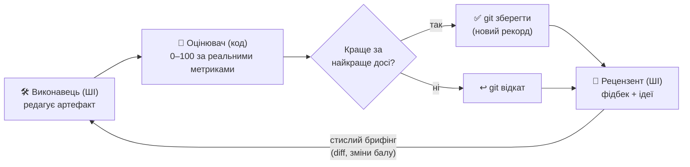

[English](README.md) · **Українська** · [Русский](README.ru.md)

# Pull-and-Push

**Два штучні інтелекти підштовхують один одного, щоб зробити твою роботу кращою — автоматично.**

Один ШІ переписує те, що ти хочеш покращити. Невеликий шматок коду оцінює результат від
0 до 100 — чесно, за реальними числами, а не «на думку». Другий ШІ читає результат і каже,
що слабке і що спробувати далі. Потім цикл повторюється. Щоразу він лишає найкращу версію, а
решту відкидає. За кілька сотень кругів виходить щось набагато краще за першу спробу — і ти
бачиш кожен крок наживо.

**Де це допомагає** — будь-що, що можна виміряти числом:

- торгова стратегія, яка має заробляти більше й не «злити» депозит,
- код, який має пройти прихований набір тестів,
- текст, який треба підняти за оцінкою по рубриці.

Ти даєш мету і спосіб її виміряти. Pull-and-Push робить за тебе тисячі дрібних спроб і
повертає найкращу.


> Реальний прогін. Бал стартує низько; цикл покращує і піднімається до цілі, лишаючи
> найкращу версію на кожному кроці. Провал біля кроку №33 — це цикл вибирається з глухого
> кута й знаходить кращу ідею.

## Як це працює



Те, що покращуємо, лежить у git — тож будь-яку зміну можна миттєво відкотити. Оцінювач
лежить *поза* ним, тож ШІ не може підглянути відповіді чи поставити оцінку сам собі. Цикл
простий: **редагувати → оцінити → лишити, якщо краще → отримати фідбек → повторити**, поки
бал не сягне цілі або не перестане рости. Найкраща версія — це те, що ти забираєш.

## Скріншоти

| Керування та прогрес наживо | Стрічка активності (найновіше зверху) |
|---|---|
|  |  |
| Композитний бал, картки метрик (з їхніми цілями) і крива якості. | Згортна панель праворуч: кожна ітерація — картка (колір за вердиктом), огляд рецензента й вивід виконавця рендеряться як Markdown. |

| Створити проєкт за один крок | Увесь робочий простір |
|---|---|
|  |  |
| Обери перевірений шаблон (іде з готовим оцінювачем) **або** згенеруй проєкт зі звичайного опису. | Список проєктів, жива панель і стрічка активності — усе на одному екрані. |

## Під капотом (для тих, хто будує)

Технічна назва — **оркестратор змагальної ко-еволюції** (у дусі GAN, `autoresearch` Карпати
та патерну адаптерів `consilium`).

- **Готові агенти, без власних моделей.** Кожна роль — наявний CLI-агент
  (`claude` / `codex` / `opencode` / `agy`). Ми пишемо лише те, що повністю контролюємо: сам
  цикл, оцінювач, запуск метрик, сховище стану і веб-інтерфейс.
- **Число дає код, ШІ лише радить.** Детермінований оцінювач рахує 0–100 з обʼєктивних
  метрик. ШІ-рецензент дає слова та ідеї — ніколи не число.
- **Лишати, якщо краще, із записом у git** — плюс короткий брифінг щокруга з реальними diff
  минулих спроб, щоб наступна спроба спиралася на попередню, а не починала наосліп.
- **Ти ніколи не вигадуєш нуль шкали.** Задаєш метриці напрям і ціль; нуль шкали
  ставиться за твоїм першим заміром (0 = звідки почав, 100 = ціль).
- **Walk-forward оцінювання (без перенавчання).** Де це важливо — як у торговому шаблоні —
  оцінювач міряє на даних, яких ШІ не бачив під час налаштування, і показує розрив
  in-sample↔out-of-sample. Це межа між результатом, що тримається, і тим, що лише гарно
  виглядав на папері.

- **Дизайн-специфікація:** `docs/superpowers/specs/2026-06-03-tyani-tolkai-design.md`
- **План:** `docs/superpowers/plans/2026-06-03-tyani-tolkai-core-mvp.md`

## Встановлення

```bash
python3.12 -m venv .venv
.venv/bin/pip install -e ".[dev]"      # включно з веб-залежностями (fastapi/uvicorn/httpx)
.venv/bin/pytest                       # весь набір проходить (1 docker-тест пропущено)
```

## Швидкий старт — панель

```bash
.venv/bin/pull-and-push web            # відкрий надрукований URL (працює й tyani-tolkai)
```

- 🚀 **Старт із шаблону** *(рекомендовано)* — фаза ресерчу та scaffold. Обери перевірений
  шаблон (або дай визначити його з опису), назви проєкт — і він створюється **готовим до запуску**:
  справжній закоммічений гарнес оцінювання лягає в `metrics/` (поза артефактом, тож виконавець
  його не бачить і не редагує), а твій опис стає метою виконавця. Жодного гарнеса власноруч,
  нічого не треба лагодити перед першим **Запуском**. Шаблони зараз: `btcusdt-futures`
  (бектест BTCUSDT 5m із плечем) і `pytest-pass` (пройти прихований набір тестів).
- 🪄 **Згенерувати з опису** — опиши завдання звичайною мовою; агент-налаштовувач складе
  весь проєкт, ти перевіриш його у формі й натиснеш **Створити**.
- ▶ **Run** запускає реальних агентів; крива якості, картки метрик, лог ітерацій і
  **🔎 лог агента** (реальний вивід виконавця) оновлюються наживо.
- ⛔ **Force Stop** негайно вбиває агента; **Stop** чекає межі ітерації.
- ⬇ **Export** завантажує **результат як `.zip`** (код артефакту + `README.md` + `RESULTS.md`).
- **Мови інтерфейсу:** англійська (за замовчуванням) · українська · російська — перемикач у
  шапці; вибір і місце в інтерфейсі памʼятаються між перезавантаженнями.
- Опційний **вебхук завершення**: смикнути твій URL (GET/POST), коли прогін завершиться.

## Реальний прогін (твоє завдання, реальні агенти)

Напиши `config.yaml` (див. `tests/fixtures/example_config.yaml`):

```yaml
project: my-task
mode: asymmetric
agents:
  executor:  { engine: claude, timeout: 600 }
  validator: { engine: codex,  timeout: 300 }   # інший провайдер (захист від «змови»)
roles:
  executor:  { goal: "Зробити, щоб усі тести проходили.", task: "Редагуй лише src/." }
  validator: { goal: "Скажи, чому бал змінився; один конкретний наступний крок." }
seed: { copy: ~/path/to/starting/code }       # empty | copy:<шлях>
evaluation:
  adapter: pytest-pass                         # numeric | command-exit | pytest-pass
  # 'worst' (точка 0 балів) опційний — ставиться за першим заміром.
  metrics: [ { name: pass_pct, dir: higher, weight: 1, target: 100 } ]
  target_score: 100
  harness_dir: metrics/                        # приховані тести, невидимі виконавцю
limits: { max_iterations: 30, plateau_N: 6, step_seconds: 600 }
sandbox: { backend: local }                    # docker | local
notify: { enabled: false, url: null, method: POST }   # вебхук завершення (опційно)
```

```bash
.venv/bin/pull-and-push run config.yaml          # запускає реальних агентів
.venv/bin/pull-and-push run config.yaml --resume # продовжити після стопу / ліміту
```

## Проєкти

```bash
pull-and-push projects list
pull-and-push projects export my-task --to my-task.zip    # портативний + результат-деліверабл
pull-and-push projects import my-task.zip --to copy-1      # продовжити на іншій машині
pull-and-push projects reset my-task                       # назад до seed, конфіг лишити
pull-and-push projects rename my-task --to renamed
pull-and-push projects delete renamed
```

## Нотатки й межі (чесно)

- **Headless-агенти** запускаються з дозволом на файлові інструменти й відʼєднаним stdin, тож
  не зависають на інтерактивному запиті (`claude`/`opencode`/`agy` отримують
  `--dangerously-skip-permissions`; `codex exec` неінтерактивний у пісочниці). Таймаут кроку —
  останній запобіжник.
- **Сумісність рушія Виконавця:** цикл запускає кожного агента з `cwd = artifact/`.
  `claude` і `codex` це поважають; `opencode`/`agy` наразі визначають власний корінь і можуть
  правити зовнішній репозиторій — **використовуй `claude` чи `codex` як Виконавця** поки що.
- **Симетричний режим** (Суперник↔Суперник + арена) — задизайнено, ще не зроблено.
- **Docker-бекенд** реалізовано; `local` повністю протестований. Тримай команди метрик
  простими (без shell-пайпів) задля сумісності бекендів.
- **Авторизація WebUI** — токен у query-параметрі URL — підходить для localhost із одним
  користувачем; для віддаленого доступу постав TLS reverse proxy.

## Тести

Весь набір проходить (1 docker-тест пропущено), у CI на Python 3.10 і 3.12 — модульні (скорер, конфіг, стан, метрики, брифінг, реєстр, пісочниця),
інтеграційні (оркестратор з mock + валідатором, baseline-нуль, force-stop, обробка відсутньої
метрики), CLI-адаптер (вкл. headless-прапорці + kill), round-trip проєктів (zip),
ендпоінти WebUI (вкл. force-stop, agent-log, webhook) і «золотий прогін», що доводить
збіжність із недоторканим harness (захист від «змови»).
