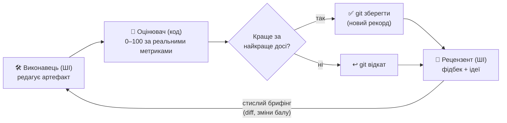
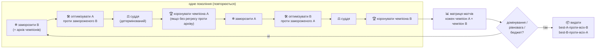

[English](README.md) · **Українська** · [Русский](README.ru.md)

# Pull-and-Push

**Два штучні інтелекти підштовхують один одного, щоб зробити твою роботу кращою — автоматично.**

Один ШІ переписує те, що ти хочеш покращити. Невеликий шматок коду оцінює результат від
0 до 100 — чесно, за реальними числами, а не «на думку». Другий ШІ читає результат і каже,
що слабке і що спробувати далі. Потім цикл повторюється. Щоразу він лишає найкращу версію, а
решту відкидає. За кілька сотень кругів виходить щось набагато краще за першу спробу — і ти
бачиш кожен крок наживо.

**Де це допомагає** — будь-що, що можна виміряти числом:

- торгова стратегія, яка має заробляти більше й не «злити» депозит,
- код, який має пройти прихований набір тестів,
- текст, який треба підняти за оцінкою по рубриці.

Ти даєш мету і спосіб її виміряти. Pull-and-Push робить за тебе тисячі дрібних спроб і
повертає найкращу.


> Реальний прогін. Бал стартує низько; цикл покращує і піднімається до цілі, лишаючи
> найкращу версію на кожному кроці. Провал біля кроку №33 — це цикл вибирається з глухого
> кута й знаходить кращу ідею.

## Як це працює



Те, що покращуємо, лежить у git — тож будь-яку зміну можна миттєво відкотити. Оцінювач
лежить *поза* ним, тож ШІ не може підглянути відповіді чи поставити оцінку сам собі. Цикл
простий: **редагувати → оцінити → лишити, якщо краще → отримати фідбек → повторити**, поки
бал не сягне цілі або не перестане рости. Найкраща версія — це те, що ти забираєш.

Це режим за замовчуванням — **asymmetric** (один артефакт, фіксована ціль). Є й **symmetric** —
**Co-Evolution Arena** — де *два* ШІ co-evolve *два* конкурентні артефакти, а детермінований
суддя (referee) вирішує, хто переміг у кожному раунді. Див.
[Co-Evolution Arena](#co-evolution-arena-симетричний--суперник--суперник) нижче.

## Скріншоти

| Керування та прогрес наживо | Стрічка активності (найновіше зверху) |
|---|---|
|  |  |
| Композитний бал, картки метрик (з їхніми цілями) і крива якості. | Згортна панель праворуч: кожна ітерація — картка (колір за вердиктом), огляд рецензента й вивід виконавця рендеряться як Markdown. |

| Створити проєкт за один крок | Увесь робочий простір |
|---|---|
|  |  |
| Обери перевірений шаблон (іде з готовим оцінювачем) **або** згенеруй проєкт зі звичайного опису. | Список проєктів, жива панель і стрічка активності — усе на одному екрані. |

| Покращити наявного бота | |
|---|---|
|  | Онбординг бота, який у тебе вже є: аналіз → пропозиція метрик → каркас + перевірка адаптера → створення проєкту, у шість керованих кроків. Далі цикл оптимізує **саме твого** бота на відкладених даних. |

## Під капотом (для тих, хто будує)

Технічна назва — **оркестратор змагальної ко-еволюції** (у дусі GAN, `autoresearch` Карпати
та патерну адаптерів `consilium`).

- **Готові агенти, без власних моделей.** Кожна роль — наявний CLI-агент
  (`claude` / `codex` / `opencode` / `agy`). Ми пишемо лише те, що повністю контролюємо: сам
  цикл, оцінювач, запуск метрик, сховище стану і веб-інтерфейс.
- **Число дає код, ШІ лише радить.** Детермінований оцінювач рахує 0–100 з обʼєктивних
  метрик. ШІ-рецензент дає слова та ідеї — ніколи не число.
- **Лишати, якщо краще, із записом у git** — плюс короткий брифінг щокруга з реальними diff
  минулих спроб, щоб наступна спроба спиралася на попередню, а не починала наосліп.
- **Контрольні точки «свіжого погляду».** Кожну 5-ту ітерацію обидва агенти отримують поштовх
  відступити й переглянути задачу з іншого боку — піддати сумніву ключове припущення, а не
  заганяти один шлях у локальний оптимум.
- **Ти ніколи не вигадуєш нуль шкали.** Задаєш метриці напрям і ціль; нуль шкали
  ставиться за твоїм першим заміром (0 = звідки почав, 100 = ціль).
- **Walk-forward оцінювання (без перенавчання).** Де це важливо — як у торговому шаблоні —
  оцінювач міряє на даних, яких ШІ не бачив під час налаштування, і показує розрив
  in-sample↔out-of-sample. Це межа між результатом, що тримається, і тим, що лише гарно
  виглядав на папері.
- **Два режими.** *Asymmetric* (вище): один артефакт проти фіксованої цілі. *Symmetric* —
  [Co-Evolution Arena](#co-evolution-arena-симетричний--суперник--суперник): два артефакти
  co-evolve, оцінює детермінований суддя, з архівом чемпіонів + матрицею матчів. Той самий
  принцип детермінованого судді; referee — якір довіри.

- **Дизайн-специфікація:** `docs/superpowers/specs/2026-06-03-tyani-tolkai-design.md`
- **План:** `docs/superpowers/plans/2026-06-03-tyani-tolkai-core-mvp.md`

## Встановлення та запуск

Потрібні **Python 3.10+** (CPython, не PyPy) і **Git**. Щоб реально запустити оптимізацію,
додатково треба один CLI ШІ-агента (див. кінець розділу).

```bash
git clone https://github.com/Lexus2016/Pull-and-Push.git
cd Pull-and-Push
./start.sh
```

На **Windows** замість останнього рядка використовуй лаунчер PowerShell:

```powershell
powershell -ExecutionPolicy Bypass -File .\start.ps1
```

`start.sh` (macOS/Linux) і `start.ps1` (Windows) створюють віртуальне середовище, усе
встановлюють і відкривають панель за адресою **http://127.0.0.1:8765**. Скрипт можна запускати повторно — додай `--port 8080`, щоб
змінити порт, або `--update`, щоб перевстановити після `git pull`. Далі у браузері:
**🚀 Новий проєкт зі зразка** → обери картку → дай назву → опиши мету → **Створити** →
натисни **▶ Запуск**.

Щоб запустити *реальну* оптимізацію, потрібен один CLI для ШІ-кодування (жодних API-ключів
тут не зберігається): встанови й увійди в **claude** (Anthropic), **codex** (OpenAI) або
**opencode**, тоді обери його в проєкті. Порада: бери *різних* провайдерів для виконавця й
валідатора.

<details><summary><b>Волієш встановити вручну (або на Windows)?</b></summary>

```bash
python3.12 -m venv .venv           # підійде будь-який CPython 3.10+ (не PyPy)
source .venv/bin/activate          # Windows: .venv\Scripts\activate
pip install -e ".[web]"
pull-and-push web                  # тоді відкрий надрукований URL (типово http://127.0.0.1:8765)
```

Запустити тести: `pip install -e ".[dev]"`, тоді `pytest` (151 проходить, 1 docker-тест пропущено).

</details>

## Оновлення (твої проєкти в безпеці)

Твої проєкти — конфіг, історія прогонів, бали й артефакт — лежать у **`~/.tyani-tolkai/`**
(змінити через `TYANI_TOLKAI_HOME`), **поза** цим репозиторієм. Тож оновлення коду їх не чіпає.

```bash
cd Pull-and-Push
git pull
./start.sh --update     # перевстановити залежності + перезапуск · Windows: powershell -ExecutionPolicy Bypass -File .\start.ps1 --update
```

- **Без втрати даних.** Старі бази проєктів мігрують **на місці** при першому відкритті (нові
  стовпці додаються ідемпотентно), тож проєкти, запущені на старій версії, працюють далі —
  відкрий і продовжуй.
- **Бали лишаються чесними після оновлення.** Якщо ти змінив метрики/цілі проєкту, наступний
  **▶ Run** автоматично перераховує всю історію на нову шкалу метрик (єдина шкала 0–100; у логу —
  `♻ objective changed → re-scored …`).
- **Опційний бекап** перед великим стрибком: `cp -r ~/.tyani-tolkai ~/.tyani-tolkai.bak` (Windows:
  скопіюй теку `%USERPROFILE%\.tyani-tolkai`).

## Швидкий старт — панель

```bash
.venv/bin/pull-and-push web            # відкрий надрукований URL (працює й tyani-tolkai)
```

- 🚀 **Старт із шаблону** *(рекомендовано)* — фаза ресерчу та scaffold. Обери перевірений
  шаблон (або дай визначити його з опису), назви проєкт — і він створюється **готовим до запуску**:
  справжній закоммічений гарнес оцінювання лягає в `metrics/` (поза артефактом, тож виконавець
  його не бачить і не редагує), а твій опис стає метою виконавця. Жодного гарнеса власноруч,
  нічого не треба лагодити перед першим **Запуском**. Шаблони зараз: `btcusdt-futures`
  (бектест BTCUSDT 5m із плечем) і `pytest-pass` (пройти прихований набір тестів).
- 🪄 **Згенерувати з опису** — опиши завдання звичайною мовою; агент-налаштовувач складе
  весь проєкт, ти перевіриш його у формі й натиснеш **Створити**.
- 🔧 **Покращити наявного бота** — онбординг бота, який у тебе вже є (аналіз → метрики → адаптер →
  перевірка → створення), щоб цикл оптимізував *саме твого* бота на відкладених даних. Повний
  розбір: [Покращити наявного бота](#покращити-наявного-бота-онбординг).
- ▶ **Run** запускає реальних агентів. Крива якості й картки метрик оновлюються наживо поряд зі
  згортною **стрічкою активності** (права рейка, найновіше зверху): огляд рецензента й вивід
  виконавця рендеряться як **Markdown**. Розкладка (стрічка відкрита/закрита, бічна панель,
  поточний проєкт і вкладка) памʼятається між перезавантаженнями.
- 📈 **Перемикання графіка** — типово малюється композитна **крива якості**. Клікни на будь-якій
  **картці метрики**, щоб побачити графік її реального значення за весь прогін (вісь автоматично
  масштабується під одиниці); клікни на **композитному балі**, щоб повернутися. Точки лишаються
  пофарбованими за вердиктом, і графік оновлюється наживо під час прогону.
- ⛔ **Force Stop** негайно вбиває агента; **Stop** чекає межі ітерації.
- ⬇ **Export** завантажує поточний best **як `.zip`** (код артефакту + `README.md` + `RESULTS.md`).
- **Мови інтерфейсу:** англійська (за замовчуванням) · українська · російська — перемикач у
  шапці (зі стилізованими тултіпами на кожному контролі). Вибір і місце в інтерфейсі зберігаються.
- Опційний **вебхук завершення**: смикнути твій URL (GET/POST), коли прогін завершиться.

### Знімки — завантажити, відкотитись або форкнути будь-яку ітерацію

Найвищий композитний бал — не завжди та версія, яку хочеш; проміжна ітерація буває цікавішою
(скажімо, вищий `return_oos_pct` за трохи нижчого зваженого балу). Кожна **залишена** (keep)
ітерація у стрічці — це справжній git-коміт, тож на її картці є три дії:

- **⬇ Завантажити цю версію** — запускний zip артефакту *саме на тій ітерації* (разом із гарнесом,
  конфігом і `SNAPSHOT.txt` із власним балом цієї ітерації), а не лише останній.
- **↻ Продовжити звідси** — відкотити проєкт до тієї ітерації: вона стає поточним best, і наступний
  **Run** продовжує з неї (з тим, що ти уточниш). Відкинутий «хвіст» тегається в git — нічого не губиться.
- **⑂ Форк у новий проєкт** — відгалузити ту ітерацію в окремий проєкт; оригінал недоторканий, тож
  оптимізуєш обидва напрями незалежно.

Знімки доступні для **keep**-ітерацій (кожна — закомічена контрольна точка); відкинуті кандидати
відкочуються й не зберігаються. Відкат/форк заблоковані під час прогону.

## Покращити наявного бота (онбординг)

Уже маєш торгового бота? Оптимізуй **його** — не шаблон. Картка **🔧 Покращити наявного бота** на
панелі (і відповідні CLI-команди) проводять безпечним, гейтованим потоком: обгортають твого бота,
доводять обгортку, а тоді будують проєкт, що тюнить твого бота на відкладених даних.


**На панелі** — натисни **＋ Новий проєкт** і скористайся карткою *Покращити наявного бота*: вкажи
теку бота, CSV з OHLCV-даними та ціль, тоді пройди шість кроків (кожен показує результат/вердикт):

1. **Аналіз** — read-only LLM-прохід будує *профіль бота* (точка входу, tunables, ризики).
2. **Метрики** — пропонує, як оцінювати бота (метрики + цілі); ти переглядаєш і лишаєш їх.
3. **Адаптер** — генерує `adapter.py` (перевірений плумбінг протоколу + заглушка `decide()`).
   **Заповни `decide()`** у редакторі, щоб він викликав логіку бота й повертав позицію (1 / 0 / -1).
4. **Перевірка** — доводить, що адаптер говорить протоколом: коректний + детермінований + не-вироджений.
5. **Створити проєкт** — кладе бота в артефакт, дані в `metrics/` (поза досяжністю бота), підключає
   перевірений оцінювач і відкриває проєкт.
6. **Валідація** *(опційно, потрібен Docker)* — звіт-докази вторинної валідації (спектр контролів,
   детермінізм, anti-look-ahead, overfit-розрив) → **PASS / FLAG**.

Тоді натисни **▶ Run**.

**З CLI** (той самий потік, крок за кроком):

```bash
pull-and-push profile       ./mybot --out ./mybot                       # → profile.json + .md
pull-and-push propose       ./mybot/profile.json --goal "max risk-adjusted return" --out ./mybot
pull-and-push gen-adapter   --bot-dir ./mybot                           # пише adapter.py — заповни decide()
pull-and-push check-adapter --bot-dir ./mybot --bot-cmd "python adapter.py"        # PASS / FLAG
pull-and-push onboard       --bot-dir ./mybot --data ./data.csv \
                            --proposal ./mybot/proposal.json --name my-bot --bot-cmd "python adapter.py"
pull-and-push validate      --bot-dir ./mybot --data ./data.csv --bot-cmd "python adapter.py" --seed my-bot
pull-and-push run           ~/.tyani-tolkai/projects/my-bot/config.yaml
```

**Навіщо обгортка + гейт?** Рушій довіряє лише перевіреному прихованому оцінювачу — ніколи коду, що
його написав ШІ. Тож твій бот ніколи не суддя: він працює **ізольовано** (Docker-пісочниця) й лише
видає ордери; PnL рахує наш рушій. `check-adapter` доводить, що обгортка коректна за протоколом;
спектр контролів у `validate` ловить семантичні помилки (інверсія знаку програє flat/random).
Повне обґрунтування: [`docs/design/onboarding-existing-bots.md`](docs/design/onboarding-existing-bots.md).

## Реальний прогін (твоє завдання, реальні агенти)

Напиши `config.yaml` (див. `tests/fixtures/example_config.yaml`):

```yaml
project: my-task
mode: asymmetric
agents:
  executor:  { engine: claude, timeout: 600 }
  validator: { engine: codex,  timeout: 300 }   # інший провайдер (захист від «змови»)
roles:
  executor:  { goal: "Зробити, щоб усі тести проходили.", task: "Редагуй лише src/." }
  validator: { goal: "Скажи, чому бал змінився; один конкретний наступний крок." }
seed: { copy: ~/path/to/starting/code }       # empty | copy:<шлях>
evaluation:
  adapter: pytest-pass                         # numeric | command-exit | pytest-pass
  # 'worst' (точка 0 балів) опційний — ставиться за першим заміром.
  metrics: [ { name: pass_pct, dir: higher, weight: 1, target: 100 } ]
  target_score: 100
  harness_dir: metrics/                        # приховані тести, невидимі виконавцю
limits: { max_iterations: 30, plateau_N: 6, step_seconds: 600 }
sandbox: { backend: local }                    # docker | local
notify: { enabled: false, url: null, method: POST }   # вебхук завершення (опційно)
```

```bash
.venv/bin/pull-and-push run config.yaml          # запускає реальних агентів
.venv/bin/pull-and-push run config.yaml --resume # продовжити після стопу / ліміту
```

## Co-Evolution Arena (симетричний — Суперник ↔ Суперник)

Другий режим co-evolve **два** артефакти, A і B, що змагаються між собою (гонка озброєнь
red-team ↔ blue-team — напр. anti-detect браузер проти бот-детектора). Кожну сторону оцінюють
не обʼєктивним числом, а **тим, як вона виступає проти іншої** — це вирішує детермінований
перевірений **суддя (referee)**: якір довіри (ніколи не LLM; жодна сторона не оцінює себе сама).
Тонкий оркестратор чергує покоління, тримає архів чемпіонів, веде матрицю матчів і зупиняється
за домінуванням / рівновагою / бюджетом. Дизайн + доказ збіжності:
[`docs/design/p6-coevolution-arena.md`](docs/design/p6-coevolution-arena.md).



Чим відрізняється від asymmetric-циклу, простими словами:

- **Суддя замість фіксованого оцінювача.** Він проганяє артефакт A проти B (у пісочниці) і видає
  обʼєктивний результат. Це **якір довіри** — детермінований, перевірений, ніколи не LLM, і жодна
  сторона не оцінює себе.
- **Внутрішній цикл переюзано без змін.** «Оптимізувати A проти замороженого B» — це той самий
  asymmetric-цикл, де суддя загорнутий як його метрика; уся машинерія Фази-1 (git «лишити, якщо
  краще», бриф, resume) працює як є. Symmetric — тонкий шар згори.
- **Архів чемпіонів + матриця матчів.** Кожна сторона тримає «залу слави»; нового чемпіона
  коронують лише якщо він не регресує проти **всього** архіву супротивника (захист від циклювання
  «камінь-ножиці-папір»). Справжній стан арени — з матриці матчів, а не з внутрішнього бала.
- **Два сигнали.** Крива, яку ти бачиш, — **стабільний** сигнал (кожна сторона проти фіксованого
  набору) — чесний прогрес. Внутрішній сигнал «побити поточного супротивника» нестаціонарний і
  ніколи не малюється.
- **Перемога — це правило зупинки, а не продукт.** Результат — найбільш *робастні* чемпіони:
  best-A-проти-всіх-B і best-B-проти-всіх-A.

Готовий суддя (`cegis-recognizer`) — це **іграшка з перевіряним фікспойнтом**, що *доводить
збіжність машинерії* (вона не просто циклить) перш ніж будь-який реальний домен; цей доказ
ганяється в CI на детермінованих rival-замінниках, без API.

```yaml
project: arena-task
mode: symmetric
agents:
  rival_a: { engine: claude, timeout: 600 }     # пише артефакт A (мусить писати в cwd)
  rival_b: { engine: codex,  timeout: 600 }     # пише артефакт B (мішай провайдерів)
roles:
  rival_a: { goal: "recognize the hidden target" }
  rival_b: { goal: "produce inputs A misclassifies" }
evaluation:                                       # для symmetric метрика фіксована:
  adapter: numeric
  command: x
  metrics: [ { name: arena_fitness, dir: higher, target: 1.0, worst: 0.0 } ]
arena:
  referee: cegis-recognizer                       # назва з реєстру перевірених суддів
  generations: 20
  per_generation_iterations: 8
  dominance_tau: 0.95
sandbox: { backend: docker }                       # суддя виконує недовірений код — ізолюй
limits: { budget_usd: 5.0, usd_per_mtok: 3.0 }     # symmetric ПОДВОЮЄ вартість — обмеж
```

```bash
.venv/bin/pull-and-push run arena.yaml            # чергова co-evolution; повторний запуск = resume / no-op
```

У **WebUI** обери *Режим → symmetric* у формі (рушії суперників + суддя + покоління), і дивись
живу **парну криву** (A vs B), лічильники чемпіонів та результат (best-A-проти-всіх-B /
best-B-проти-всіх-A). Stop зупиняє між поколіннями; ран відновлюється. Щоб узяти реальний домен,
реалізуй протокол `Referee` (`src/tyani_tolkai/arena/referee.py`) і зареєструй — машинерія арени
домен-агностична. Див. [`SECURITY.md`](SECURITY.md): суддя виконує недовірений код сторони —
ізолюй (`sandbox.backend: docker`).

## Проєкти

```bash
pull-and-push projects list
pull-and-push projects export my-task --to my-task.zip    # портативний + результат-деліверабл
pull-and-push projects import my-task.zip --to copy-1      # продовжити на іншій машині
pull-and-push projects reset my-task                       # назад до seed, конфіг лишити
pull-and-push projects rename my-task --to renamed
pull-and-push projects delete renamed
```

## Нотатки й межі (чесно)

- **Headless-агенти** запускаються з дозволом на файлові інструменти й відʼєднаним stdin, тож
  не зависають на інтерактивному запиті (`claude`/`opencode`/`agy` отримують
  `--dangerously-skip-permissions`; `codex exec` неінтерактивний у пісочниці). Таймаут кроку —
  останній запобіжник.
- **Сумісність рушія Виконавця:** цикл запускає кожного агента з `cwd = artifact/`.
  `claude` і `codex` це поважають; `opencode`/`agy` наразі визначають власний корінь і можуть
  правити зовнішній репозиторій — **використовуй `claude` чи `codex` як Виконавця** поки що.
- **Симетричний режим** (Суперник↔Суперник + арена) — **готовий** (CLI + WebUI з парними кривими,
  персист/resume, Stop, ліміт бюджету). Доведено збіжність на іграшковому referee з перевіряним
  фікспойнтом; реальний домен-referee і наскрізний прогін на справжніх LLM — наступний крок (машинерія
  домен-агностична). Docker-пісочниця для referee реалізована, але її «живий» прогін ще не валідовано в CI.
  Конфіг: `mode: symmetric`, блоки `agents.rival_a/rival_b` + `arena.referee` — див. англомовний README і `docs/design/p6-coevolution-arena.md`.
- **Docker-бекенд** реалізовано; `local` повністю протестований. Тримай команди метрик
  простими (без shell-пайпів) задля сумісності бекендів.
- **Авторизація WebUI** — токен у query-параметрі URL — підходить для localhost із одним
  користувачем; для віддаленого доступу постав TLS reverse proxy.

## Тести

Весь набір проходить (1 docker-тест пропущено), у CI на Python 3.10 і 3.12 — модульні (скорер, конфіг, стан, метрики, брифінг, реєстр, пісочниця),
інтеграційні (оркестратор з mock + валідатором, baseline-нуль, force-stop, обробка відсутньої
метрики), CLI-адаптер (вкл. headless-прапорці + kill), round-trip проєктів (zip),
ендпоінти WebUI (вкл. force-stop, agent-log, webhook) і «золотий прогін», що доводить
збіжність із недоторканим harness (захист від «змови»).
